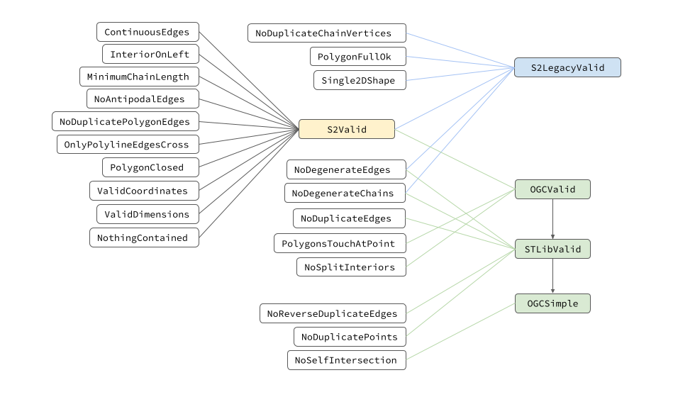
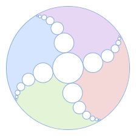

<table style="border-collapse: collapse" cellpadding="0" cellspacing="0">
  <thead>
    <tr>
      <th colspan="2">
        <h2>
        <font style="color: #1976d2; font-family: monospace; font-weight: normal">
            S2ShapeIndex Validation
        </font>
        </h2>
        <font color="#2196f3">Better living through invariants</font>
      </th>
      <th>Provide the ability to validate shapes in an S2ShapeIndex according
to one of several correctness models.</th>
    </tr>
  </thead>
  <tbody>
    <tr>
      <td><strong>Author</strong>: Sean McAllister<br>
<strong>Contributors</strong>:<br>
      [removed for privacy]</td>
      <td><strong>Status</strong>:  Final <br>
<strong>Created</strong>:  Mar 21, 2022 <br>
<strong>Modified</strong>: Jun 22, 2022</td>
      <td><strong>Self Link</strong>: [removed]<br>
<strong>Context</strong>:   [removed]<br>
<strong>Visibility</strong>:
Public</td>
    </tr>
  </tbody>
</table>

## Goals

Build functionality to validate the geometry in `S2ShapeIndex` instances with a
configurable model of correctness, with an ultimate goal of providing
functionality to replace `S2Polygon` IsValid, and implement an `ST_IsValid`
predicate.

## Motivation

`S2Polygon` provides an `IsValid()` function that checks a number of invariants
that are expected to hold. `STGeography` is valid *by construction*, and
`S2Shape` doesn't have a validation function at all. We don't have the ability
to take an arbitrary S2ShapeIndex and verify it meets the constraints to be
treated as a particular geometric object. We'd like to be able to take an
`S2ShapeIndex` containing arbitrary geometry (points, lines, and polygons) and
validate it as a single unit with a configurable model of correctness.

The goal isn't necessarily to validate the consistency of an index itself, but
rather to validate the geometry *in* the index to verify that it can be used in
situations where e.g. an `S2Polygon` or an `STGeography` are needed.

## Background

### Why Validation

The purpose of validating geometry is to ensure that it meets some set of
constraints that let us reason about it and make statements such as "point X is
contained in polygon Y" robustly. It's beneficial to think of geometry
topologically, as sets of points that divide the domain they occupy. We can
define multiple partitioning schemes (such as points in the interior, exterior,
and boundary). But the simplest mental model is to view geometry as point sets
partitioning space into two pieces: points that are part of the geometry and
points that aren't. In the most lax sense, valid geometry is just geometry where
points are unambiguously members of at most one of these two sets. This
immediately forbids polygons with self intersecting edges:

<p align="center">
  
</p>

Not least because determining actual points of intersection is numerically
difficult, but because we have to make up an arbitrary rule to determine whether
the overlapping regions are part of the interior of the geometry or not. Note,
however, that polygons with multiple disconnected interiors are allowed under
this definition, since there's no ambiguity:

<p align="center">
  
</p>

For S2, it's always possible to rebuild geometry with e.g. `S2Builder` to remove
any degeneracies and ambiguities such as duplicate edges, reverse duplicate
edges, or polygons with overlapping interiors, but this can often be cost
prohibitive, especially if it's known that the geometry was originally valid. We
would like to be able to simply check that it remains valid according to a
specific model of correctness and continue using it. Validation lets us verify
our assumptions and operate on geometry with confidence.

### OGC Data Model

The Open Geospatial Consortium (OGC) defines a standardized hierarchy of
geometric types including points, line strings, polygons, and more specific
subtypes. It also defines a set of "Collection" types which aggregate geometry
together. The type hierarchy can be seen in the image below, which shows the
types and their dimensions.

<p align="center">
  
</p>

A 0, 1, or 2-dimensional `S2Shape` would correspond to a `MultiPoint`,
`MultiLineString`,` `or`MultiPolygon`, respectively, and an `S2ShapeIndex`
containing many shapes could be any of the above, or a generic
`GeometryCollection` containing a mix of dimensionality.

Note that the OGC types specifically require linear interpolation between
points, which means that edges are "straight lines" in the chosen spatial
reference system.

Using straight lines as edges has shortcomings when working with geographic
data, which is referenced to the surface of an ellipsoid. To address this, the
`Geography` type was designed, specifically representing edges as geodesics.

#### Validity

There are some geometric configurations that are simply not allowed by the OGC
spec. Beyond the basics of requiring points and vertices to be non-infinite and
non-nan, there are restrictions on some types we must check for `ST_IsValid` to
be true. `Points` and `LineStrings` are inherently valid (though not necessarily
simple as we'll see). Polygons, however, have several restrictions to make them
topologically reasonable:

-   May not have any cuts or spikes as they affect closed-ness.
-   Chains must be closed.
-   Chains may not cross and chains may touch but only at a vertex.
-   Polygon interiors cannot be split (i.e. they are one connected point set)
-   Chains can't contain each other (i.e. they must face each other properly).
    -   Said another way the winding number of any point must be 0 or 1.

Cuts and spikes in a polygon are forbidden because they can make the geometry an
open set (i.e. not equal to its own closure):

<p align="center">
  
</p>

Split polygon interiors are also forbidden, and interiors can be divided in
non-obvious ways that have to be detected, such as a single edge crossing the
interior:

<p align="center">
  
</p>

Or, being split by a chain of connected holes:

<p align="center">
  
</p>

#### Simplicity

The OGC Simple Features specification (SFS) differentiates between geometry that
is merely *valid* and geometry that is _simple. _Simple geometry is always valid
but the converse isn't true. A simple example of this is a `MultiPoint`
containing the same point twice. This doesn't qualify as *simple*, but it is
*valid*.

*Simple* geometry is constructed in such a way that it's possible to
unambiguously categorize every point as being in the *interior*, on the
*boundary*, or in the *exterior* of a feature. These three categories of points
are used to define relationships between different features using the
dimensionally extended nine intersection model (DE-9IM).

For the built-in OGC types, the rules to ensure simplicity are summarized here:

-   `Point` - Points are always *simple*.
-   `MultiPoint` - MultiPoints are *simple* if no two points are equal.
-   `LineString` - LineStrings are *simple* if they don't pass through the same
    point twice, excluding the endpoints for a closed LineString.
-   `MultiLineString` - MultiLineStrings are *simple* if all their elements are
    simple and intersections between any two members occur on the boundary
    (endpoints, closed LineStrings may not touch)
-   `Polygon` - A *valid* Polygon is *simple*.
-   `MultiPolygon` - MultiPolygons are _simple _if all members are *simple*, no
    two members have intersecting interiors, and any two members that touch do
    so at a finite number of points (i.e. not along an edge).

Ultimately, we'll want to be able to determine whether geometry is *simple*,
*valid*, both or neither.

### STLib

#### Validity

The OGC spec allows `GeometryCollection` subclasses to place additional
constraints on the overlap between elements, but PostGIS elects not to for
`Geography`, instead treating it simply as a regular `GeometryCollection` with
an appropriate spatial reference system id
([SRID](https://en.wikipedia.org/wiki/Spatial_reference_system)) set.
[Simple](https://github.com/libgeos/geos/blob/f2784527e9b397817ccdcba207bc17b21ea0c976/include/geos/operation/valid/IsSimpleOp.h#L52-L94)
and
[valid](https://github.com/libgeos/geos/blob/2b1173ffb6631762cc438dee5ebc67b65b83ad78/src/operation/valid/IsValidOp.cpp#L250-L259)
checks are applied independently to each member element, and elements are
allowed to overlap. This presents issues when we wish to process the geometry
robustly.

##### Higher Kinded Regions

We can classify a particular pointset by the
[winding number](https://en.wikipedia.org/wiki/Winding_number) of its points.
Points that are in the exterior of all geometry have a winding number of 0, and
those that are contained once by a polygon have a winding number of 1.
Additional nested containment increments the winding number each time.

<p align="center">
  
</p>

The DE-9IM models relationships between regions of winding number 0 and 1, and
the boundary between them, for a total of three region types. It's possible to
extend this model to accommodate regions with higher winding, but the number of
relationships to track grows extremely quickly.

The DE-9IM has 9 total terms and thus 2<sup>9</sup> = 512 relationships. A model
supporting winding 2 regions and additional boundaries would have a total of 6
types of region, for 36 total terms, or 2<sup>36</sup> = 68,719,476,736
relationships. Modeling winding 3 regions as well puts the number of
relationships over 1030.

The vast majority of these relationships do not have a meaningful name in human
language and so aren't terribly useful when trying to do "real work" with
geometric data. Even the DE-9IM only names ~10 of its 512 relationships. In the
interest of tractability, it behooves us to limit ourselves to regions of
winding 0 and 1.

To avoid needing rules for higher-winding regions, STLib adopts a rule intended
to disallow them altogether. Geometry in a particular `Geography` may not
overlap in such a way as to have redundant information. Representing multiple
overlapping layers requires separate `Geography` instances for each layer.

##### Dissolving

To enforce this, STLib operates on *dissolved* geometry, which is a
canonicalization process that removes ambiguities and redundancy in the data.
It's implemented as a cross-dimensional *union* operation that merges geometry
and only leaves geometric features that add information by extending the covered
point set in some way. For example, when two polygons share an edge, the extra
edge adds no additional information and raises questions about the closed-ness
of the polygon, so it's removed:

<p align="center">
  
</p>

Sharing a single point on the boundary, however, does not affect the closedness
of the interior, so it's left unmodified:

<p align="center">
  
</p>

When a higher dimensional object overlaps a lower dimension object, the
overlapping region doesn't add any additional information, so it's removed, with
the lower dimensional object being split as needed:

<p align="center">
  
</p>

<p align="center">
  
</p>

#### Simplicity

These rules are intended to prevent overlapping geometry, so that a given
`Geography` instance partitions the world into two sets: contained and not
contained. In general, this means that elements of a `Geography` must be
*simple*, and we also disallow features that don't extend the covered point set
in some way.

Additional constraints that STLib requires:

-   Reverse duplicate edges aren't allowed either since polylines can't overlap
    the boundary of a polygon and polygons can only touch at a point already.
    Duplicate edges are always forbidden.
-   Points may not overlap any other points or vertices.

Eventually, we will allow polylines that self intersect as in a GPS track, in
which case we will have to have a separate check for self intersecting polylines
to verify simplicity.

### S2Polygon Validity

[S2Polygon::IsValid()](https://github.com/google/s2geometry/blob/master/src/s2/s2polygon.cc#L225-L232)
does the following checks:

-   Vertices must be unit length.
-   A loop must be empty, full, or have 3+ vertices.
-   A loop can't have duplicate adjacent vertices.
-   A loop can't have antipodal adjacent vertices.
-   Loops can't share edges (no duplicate or reverse–duplicate edges).
-   A polygon can't have loops with zero vertices.
-   A polygon can have the full loop iff it's the only loop.

To ensure the polygon is suitable for point containment queries:

-   A Polygon can't have crossing loops.
-   And no loop can have crossing edges.

### S2BooleanOperation Validity

As opposed to S2Polygon and OGC Geography, the requirements for geometry to be
valid for use with
[S2BooleanOperation](https://github.com/google/s2geometry/blob/master/src/s2/s2boolean_operation.h)
are comparatively lax:

#### Required

-   Polygon interiors must be disjoint from all other geometry.
-   Duplicate polygon edges aren't allowed (even among separate polygons)

#### Allowed

-   S2ShapeIndex _may _contain any number of points, polylines and polygons
-   Point polylines composed of a degenerate edge AA
-   Point loops composed of a single degenerate edge AA
-   Sibling edge pairs such as {AB, BA}

    -   These may represent shells or holes.
    -   Or may represent separate polygons touching.

-   Points and polyline edges are treated as a multiset and may have duplicates

-   Polylines may have duplicate edges and self intersect.

### Interior Tracking and Edges

We'll discuss briefly how interior tracking in indexes work and why this imposes
constraints on the type of edges we can have (i.e. duplicates and reverse
duplicates).

Each shape in an index contains a flag indicating whether the center of a
particular cell is contained in the shape. Put another way, we create a mapping
of S2CellId => [ClippedShapes] when building an index, and each clipped shape
knows whether the center point of the cell is in the interior or exterior of the
shape. This enables queries such as `S2ContainsPointQuery` to draw a line
between the query point and the cell center, and merely count edge crossings to
determine whether the point is inside or outside of the shape.

Conceptually, tracking each shape's interior is done by drawing a continuous
curve between cells as we build the index. We define an *entry* and _exit
_vertex for every cell based on its *ij* coordinates and move from the entry
point to the child cells, to the cell exit point. The entry and exit points are
chosen so that the *exit* vertex of one cell is the *entry* point of the next
cell in the hilbert order.

This ultimately gives us a curve that continuously moves between the cell
centers:

<p align="center">
  
</p>

As we move the curve through a cell, we track which edges we cross and toggle
the containment flag for the corresponding shape.

The net result is that no matter how a polygon is distributed amongst cells in
an index, we always have an accurate accounting of its interior. *But*, this
requires that every edge we encounter moves us from the interior to the exterior
or exterior to interior.

This 1:1 requirement between edge crossings and interior transitions is what
gives way to the rule that we may not have duplicate edges and that polygons
must not self intersect. To visualize this second case, just imagine the
interior/exterior arrangement of any two crossing edges from the same polygon.
Interiors are on the left, so the opposite side of each edge must be the
exterior. No matter how we arrange it, we can't make crossing edges consistent
with the 1:1 rule:

<p align="center">
  
</p>

Similarly, duplicate edges require us to toggle twice, so we remain in the
interior or exterior, but since interiors are on the left, we can't have
interior or exterior on both sides of a double edge, because one side will
always be oriented incorrectly. *Reverse* duplicate edges, however, present no
such contradiction and are allowed.

<p align="center">
  
</p>

What's more, even between polygons, duplicate edges represent a double
containment issue, because we have two interiors on the left, and polygon
interiors must be disjoint, so duplicate edges are prohibited everywhere.

As far as actually detecting crossing edges, interior crossings are
comparatively simple. We can check each edge pair in a cell and see if there's
an interior crossing point with `S2EdgeCrosser`. But how do we detect whether
there's a crossing at a vertex? Such as this situation:

<p align="center">
  
</p>

The answer is that we can number the incoming edges as -1 and outgoing edges as
+1, and visit them in a counter-clockwise order. We scan forward from an
outgoing edge to its subsequent incoming edge and if any chains have summed to a
value other than zero at that point, then we know we've got an edge intervening
and thus it must be a crossing from one interior to another:

<p align="center">
  
</p>

Note that, to support reverse-duplicate edges, we must be consistent in how we
order edges with their siblings. We take the convention that outgoing edges in a
sibling pair must come first in CCW order. This means that if we start at an
outgoing edge, we'll always encounter its reverse duplicate on the next edge and
stop scanning, with no other edges able to intervene.

## Design

### Predicates

<table>
  <thead>
    <tr>
      <th><strong>Predicate</strong></th>
      <th><strong>Description</strong></th>
    </tr>
  </thead>
  <tbody>
    <tr>
      <td>ContinuousEdges</td>
      <td>edge[i].v1 == edge[i+1].v0</td>
    </tr>
    <tr>
      <td>MinimumChainLength</td>
      <td>0D shape chains must have exactly one degenerate edge (a point), 1D
and 2D chains must have at least one edge.</td>
    </tr>
    <tr>
      <td>NoAntipodalEdges</td>
      <td>No edges with antipodal vertices</td>
    </tr>
    <tr>
      <td>NoChainCrossings</td>
      <td>Polygon chains do not cross, they may meet at a point.</td>
    </tr>
    <tr>
      <td>NoDegenerateChains</td>
      <td>2D shape chains must have at least 3 edges</td>
    </tr>
    <tr>
      <td>NoDegenerateEdges</td>
      <td>1D and 2D shapes may not have degenerate edges</td>
    </tr>
    <tr>
      <td>NoDuplicateChainVertices</td>
      <td>Chains may not contain the same point twice, excluding the endpoints
when closed.</td>
    </tr>
    <tr>
      <td>NoDuplicateEdges</td>
      <td>No duplicate edges at all.</td>
    </tr>
    <tr>
      <td>NoDuplicatePoints</td>
      <td>Any points contained in a 0D S2Shape must not overlap any other point
or vertex and must be represented only once.</td>
    </tr>
    <tr>
      <td>NoDuplicatePolygonEdges</td>
      <td>No duplicate edges {AB, AB} between or within polygons.</td>
    </tr>
    <tr>
      <td>NoReverseDuplicateEdges</td>
      <td>No reverse duplicate edges at all (e.g. {AB, BA})</td>
    </tr>
    <tr>
      <td>NoSelfIntersection</td>
      <td>Polylines may not self-intersect, excluding endpoints.MultiPolylines may only intersect at endpoints.</td>
    </tr>
    <tr>
      <td>NoSplitInteriors</td>
      <td>The interiors of polygons are topologically connected (ie no pinch
points)</td>
    </tr>
    <tr>
      <td>NothingContained</td>
      <td>No geometry is contained in the interior of any other.</td>
    </tr>
    <tr>
      <td>OnlyPolylineEdgesCross</td>
      <td>Only polyline edges may cross, and only to self-intersect.</td>
    </tr>
    <tr>
      <td>PolygonClosed</td>
      <td>If a 2D shape chain has more than one edge, it must have at least 3
edges and be closed.</td>
    </tr>
    <tr>
      <td>PolygonFullOk</td>
      <td>A polygon may have an empty chain if it's the only chain</td>
    </tr>
    <tr>
      <td>PolygonsTouchAtPoint</td>
      <td>Polygons may not share edges, duplicate or reverse duplicate.  They
may touch at a point.</td>
    </tr>
    <tr>
      <td>Single2DShape</td>
      <td>Only one shape is in the index, and it is 2D</td>
    </tr>
    <tr>
      <td>ValidCoordinates</td>
      <td>Points/Vertices aren't inf or NaN and have unit magnitude </td>
    </tr>
    <tr>
      <td>ValidDimensions</td>
      <td>S2Shapes have valid dimension value</td>
    </tr>
  </tbody>
</table>

We can distill these requirements into a list of predicates that we need to show
are true for a given set of geometry. Different subsets of predicates will be
used for different validation semantics.

We define five semantic models to cover the background cases discussed above:
`S2Valid`, `S2LegacyValid`, `OGCValid`, `STLibValid`, and `OGCSimple`.

`S2Valid` is the most lax semantic model and does basic checking that interiors
are properly oriented, geometry doesn't overlap, etc. Degeneracies are
explicitly supported. Altogether these are the requirements needed to be able to
use `S2BooleanOperation` on the geometry.

`S2LegacyValid`is intended to support `S2Polygon` validation semantics, and is a
combination of `S2Valid`, `Single2DShape` and other predicates.

Finally, we differentiate between geometry that is merely valid according to the
OGC specification with `OGCValid`, we add additional constraints to check for
dissolved geometry for `STLibValid` and, lastly, we check for polyline self
intersection for `OGCSimple`.

These rules are shown in the following dependency graph showing how predicates
roll up into final semantic categories:

<p align="center">
  
</p>

### Index Confidence

Given a pointer to an `S2ShapeIndex`, how do we know that it contains consistent
information? It's possible that a user could give us an implementation that's
inaccurate in every way about the underlying geometry (inconsistent interior
state, etc).

It's possible to bootstrap confidence in an index, but it requires repeating the
interior tracking logic that would have been used to build it and verifying that
it's consistent. This is somewhat expensive and, in general, we don't expect to
be dealing with adversarial indices.

So we'll take the position for purposes of *geometry* validation that indexes
were constructed properly (e.g. via MutableS2ShapeIndex or similar), so that the
relationship between edges and cell centers is *consistent* and edges are in
their proper cells.

### Interiors On The Left

As long as we don't have any duplicate edges, we can *assume* that the interior
state of the index is correct and check edge orientation independently on a
cell-by cell basis. If the interior state *isn't* correct, then we'll return an
error that edges aren't properly oriented.

We have to be a bit careful, however, since we can have multiple edges of a
single shape in a cell, and they are not, in general, oriented the same with
respect to the cell center. We can use `S2EdgeCrosser` to count the number of
crossings with other edges from the same polygon between one edge vertex and the
cell center. The containment state of the cell ***xor*** each crossing will tell
us the orientation the edge should have.

We can see below that edges that should be oriented CCW with respect to the cell
center will have an even number of crossings and those that should be CW have an
odd number of crossings.

<p align="center">
  
</p>

We know that every time we cross an edge, we toggle the interior, and that
interiors are on the left. So, every time we cross an edge of the same polygon,
the orientation of edges relative to the cell center must flip to maintain
consistency.

We also assume that edges and cell centers are consistent, *but* it's possible
that they can be consistent, but in the wrong direction. The interior tracking
for a polygon is either entirely correct or entirely wrong. But, since we assume
consistency, we only have to check a shape's chains once the first time we
encounter it to convince ourselves that all the interior flags for that chain
are correct.

#### Initial Seeding

So, we can draw an imaginary line from a vertex to the cell center, toggling as
we go, but what do we use for the initial interior state at the vertex? Since
the vertex is part of the shape boundary is it contained or not? And we may have
multiple edges incident on the vertex.

To resolve this we can note one property that's very useful: The interior of a
polygon is always on the left of an edge. That means if we start at an edge and
rotate an infinitesimal amount counter-clockwise around its first vertex, we'll
always be in the interior of the shape, from the edge's perspective. If we keep
rotating, any further edges must toggle the interior or they're improperly
oriented (see above).

Given that, we can take all the edges incident on the vertex we want to test,
sort them counter-clockwise, and toggle the interior bit on each one we hit
until we hit a synthetic target edge we draw from the vertex to the cell center.
This gives us the correct starting state and we can proceed to cross edges and
toggle the interior normally.

### Connected Interiors

It's possible to have edges that split interiors without any interior vertices:

<p align="center">
  
</p>

There's no containment check that will notice that the diagonal edge is in the
interior of the polygon, nor will edge-crossing tests save us. Fortunately,
there's no way to add an edge in this manner that won't make the interior state
inconsistent, and thus either the edges in the top half or the bottom half will
not be oriented properly.

In general, split interiors are allowed as long as it's not due to an aberrant
edge like above, or caused by self-intersection, S2BooleanOperation is fully
capable of handling multiple interior areas. OGC semantics, however, explicitly
require that polygon interiors be connected. And, in general, interiors can be
split in arbitrarily complex ways by chaining holes together, including cases
where the holes are disjoint from the shell:

<p align="center">
  
</p>

<p align="center">
  
</p>

<p align="center">
  
</p>

We thus need a robust way of detecting chains that touch and working backwards
to determine whether they split the interior or not. We can reframe the problem
in graph language by considering each point in shape where more than two edges
meet (a _tangent point) _to represent a node, and each path of edges along a
chain between tangents to be an edge in the graph. If we do this, the three
shapes above look like the following graphs:

<p align="center">
  
</p>

Note that we do *not* completely connect tangent points on a given chain back to
the start, as that would always complete a cycle in the graph along a chain, and
isn't necessary to capture the connectivity of the chains. If we removed the
outer three holes in each arm from the second example, the graph would become
properly acyclic since the centermost hole does not form a cycle:

<p align="center">
  
</p>

If we consider any shape where the chains never touch, we can see immediately
that it will be a null graph containing no nodes or edges, and thus trivially
non-cyclic. In the case of a polygon with one interior ring that touches at
*one* tangent point. The graph would contain one node and no edges, again
trivially non-cyclic:

<p align="center">
  
</p>

If we allow the hole to touch the other side and split the interior, we have two
nodes and two edges (one along the shell and one along the hole), a cyclic
graph:

<p align="center">
  
</p>

To split the interior of a polygon, we need to form two interior regions that
can't be continuously reached from each other. A useful analogy for deciding
whether two regions are connected is "Can I put a pen down and draw from one
region into the other without crossing the polygon boundary?". If the answer is
yes, then the regions are connected, otherwise they're not.

The only way an interior can become split is by forming a closed loop around an
interior region, either by connecting at least two points on the shell by a
chain of holes, or by drawing a connected chain of holes in the interior that
separates a region.

Either way, there are points on the polygon boundary (interior or exterior) that
you can start at, and, moving along the boundary of the polygon, return to your
starting point. Polygons with disconnected interiors have *cycles*.

But, is the converse true? If a graph has cycles does it represent a shape with
a split interior? The answer, in general, is no. Without even resorting to the
fact that S2 works on a closed 2D surface, we can find a polygon with a cyclic
graph that doesn't have a split interior, which is simply the complement of the
third polygon example above:

<p align="center">
  
</p>

This looks exactly like the graph for the complement polygon above. We'd like to
exclude these valid polygons from our test, but how can we tell them apart?
Let's further consider how chains might meet at a point.

Since we're already going to check for crossing edges, and properly oriented
interiors, there's only two ways that two chains can meet at a tangent point:
the interior can be between edges of the same chain, or between edges of
different chains. We can call these two situations a *bounce* or a *pinch*,
respectively:

<p align="center">
  
</p>

We can see in the first example how each incoming chain "bounces" off the
intersection point, and doesn't rely on the other chain to define the interior;
if we pulled the chains apart horizontally we'd have two disjoint chains each
containing the interior.

In the second example, however, each incoming edge in each chain relies on an
outgoing edge from the *other* chain to define the interior. If we pulled
*these* chains apart horizontally, the interior would stretch with them:

<p align="center">
  
</p>

We can see how the "pinch" configuration in some sense separates the interior in
a continuous topological way. A bounce is equivalent to two shells touching at a
tangent point, while a pinch is equivalent to two holes touching, *or* a hole
touching a shell.

<p align="center">
  
</p>

We can easily detect pinches by looking at each ingoing edge at a vertex, and
seeing if the next edge (ordered CW around the vertex) is the next edge in the
same chain or not. This makes intuitive sense because we're effectively saying
that, for a bounce, there can't be any intervening edges between the ingoing and
outgoing edges of a particular chain.

If we restrict ourselves to building a graph with nodes just for pinch points,
then we can detect split interiors by detecting cycles in the graph. There are a
few special cases we have to think about though. The first is a shell that's
pinched through a self tangency:

<p align="center">
  
</p>

This is still equivalent to a pinch, and splits the interior. It's somewhat
special in that the two chains that are pinching are one and the same, but, we
can treat it the same as a pinch between any two chains, we'll just add the same
pinch point *twice* for the same chain. This will ensure a cycle in the
resulting graph, which we'll detect.

In the case of a hole that's self tangent, the pinch becomes a bounce, and we'll
safely ignore it:

<p align="center">
  
</p>

Next, there's no reason that a tangency has to be between only two chains, for
example, here's a bounce and pinch configuration between four chains, we can
even have a combination of bounces and pinches:

<p align="center">
  
</p>

If we look at a shape containing a pinch like that, and its associated graph:

<p align="center">
  
</p>

We can see why we were careful to define the graph in terms of the tangent
points, with edges connecting them. The central point shared by the holes on its
own doesn't generate a cycle. If we disconnected the holes from the shell, the
graph would collapse to a single node, which is trivially acyclic.

We can gather the information we need for the graph as we work through the
index. If we store a mapping of `S2Shape => [(chain, vertex)]` pairs for each
shape that has tangency points, then at the end of the validation process we can
use a [disjoint set](https://en.wikipedia.org/wiki/Disjoint-set_data_structure)
data structure to find cycles

as follows:

```python
def CheckInteriorConnected(tangent_list):
  tangent_list = sort(tangent_list by chain) # exact ordering within chain is irrelevant
  ds = DisjointSet()

  # Create singleton sets for each point
  for value in tangent_list:
    ds.Make(value.vertex)

  # Add edges, if we find two vertices connected, we have a loop
  for ii < len(tangent_list)-1:
     curr = tangent_list[ii]
     next = tangent_list[ii+1]
     if (curr.chain == next.chain):
        curr_root = ds.Find(curr.vertex)
        next_root = ds.Find(next.vertex)

        if (curr_root == next_root):
           return Error("Disconnected interior found")
       ds.Union(curr_root, next_root)

  return true
```

Note that we expect most shapes to have zero tangent points so in the common
case we do no work (O(0)!). In the more general case, the disjoint-set has ~O(1)
complexity for `Find`and `Union` (technically O(Ackermann-1(n)) which is < 5 for
all realistic values), so processing the edges is O(n) and thus the overhead is
dominated by the `sort` call which is O(n log n) in the number of tangent
points.

### Validation Process Details

With those tools available, we're now ready to define the validation processing.
We can break the process up into two stages. First, we can run any checks that
can be done independently on the shapes in the index. These include:

-   `ValidDimensions`
-   `MinimumChainLength`
-   `PolygonClosed`
-   `Single2DShape`
-   `PolygonFullOk`

These are easy O(1) checks that don't require index information to verify.
Checking them first will at minimum tell us that polygons in the index represent
some closed (possibly degenerate) loop, and they provide easy criterion for
short-circuiting the rest of the validation.

Now, we can begin the validation process in earnest. As we go we'll maintain two
additional pieces of state: a map from `S2Shape` to the CellId where we first
encountered it, and map from `S2Shape` to a list of (chain,vertex) pairs for
separated interior tracking. We'll proceed cell-by-cell in the index, validating
as we go. We'll assume that the index is valid until proven otherwise.

The following pseudocode shows the basic logic:

```python
# Initial O(1) checks.
MaybeCheck(Single2DShape(index))

for shape in index:
  Check(ValidDimensions(shape))

  if (shape.dimension() == 2):
    Check(MinimumChainLength(shape))
    Check(PolygonClosed(shape))
    MaybeCheck(PolygonFullOk(shape))

# Store tangency points
tangent_map = Map<S2Shape*,[(chain,vertex)]>()

for cell in index:
  # Check dimension 2 edges in the cell for duplicates.  By definition duplicate
  # edges will appear in the same cell(s).
  Check(NoDuplicatePolygonEdges(cell))
  MaybeCheck(NoReverseDuplicateEdges(cell))

  # If a chain touches itself, both edges will end in the same cell at some point, so
  # we can detect duplicate edges locally by just checking the edges in each cell.
  MaybeCheck(NoDuplicateChainVertices(cell))

  # Maybe we shouldn't have duplicate edges at all (e.g. for OGCValid)
  MaybeCheck(NoDuplicateEdges(cell))

  # Maybe check any points in the cell to ensure they don't overlap any other
  # point or vertex.
  MaybeCheck(NoDuplicatePoints(cell))

  # Check basic validity for edges (doesn't affect duplicate check).
  for edge in cell:
    Check(ValidCoordinates(edge))
    MaybeCheck(NotAntipodal(edge))
    MaybeCheck(NotDegenerate(edge))

  # Check that polygons don't have crossing edges.
  Check(OnlyPolylineEdgesCross(cell))
  MaybeCheck(NoChainCrossings(cell))

  # Disallow degenerate chains for STLib
  MaybeCheck(NoDegenerateChains(cell))

  # Find any pinch points and add edges
  for shape in cell:
    tangent_map[shape].append(TangentPoints(shape, cell))

  for edge in cell:
    # Check that edges are continuous.
    if (edge.shape.dimension == 1 or 2):
       Check(edge.v1 == next(edge).v0)

    # Count crossings and check that edges are oriented to keep the interior on the left.
    if (edge.shape.dimension == 2):
       Check(EdgeOrientedProperly(edge))

    # Since there's no crossing edges, we know each edge is either entirely inside,
    # entirely outside, or a vertex of each polygon, so we can verify NothingContained by
    # checking the first vertex of each edge against each polygon.
    for shape in cell:
       if not shape in first_cells:
         first_cells[shape] = cell

       if (edge.shape != shape):
         <draw line from cell center to edge.v0, toggle shape interior bit>
         Check(!inside(shape))

# Check for disjoint interiors.
for shape, tangent_list in tangent_map:
  CheckInteriorConnected(tangent_list)

# Index is now valid.
```
