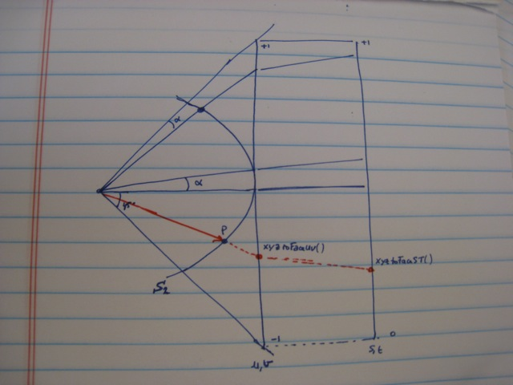

# S2 Geometry Library

[TOC]

## Overview

This is a package for manipulating geometric shapes.  It is especially
suitable for geographic data, because the S2 library has excellent support for
spherical geometry (i.e., shapes drawn directly on the sphere rather than on a
2D map).  In fact, the name "S2" is derived from the mathematical notation
for the unit sphere.

Currently the package consists of:

* Basic representations of angles, intervals, latitude-longitude points, unit
  3D vectors, and conversions among them.

* Various shapes over the unit sphere, such as spherical caps ("discs"),
  latitude-longitude rectangles, polylines, and polygons.  These are
  collectively known as "regions".

* Support for spatial indexing of collections of geometry, and algorithms for
  testing containment, finding nearby objects, finding intersections, etc.

* A hierarchical decomposition of the sphere into regions called "cells".
  The hierarchy starts with the six faces of a projected cube and
  recursively subdivides them in a quadtree-like fashion.

* The ability to approximate arbitrary regions as a collection of
  cells.  This is useful for building inverted indexes that allow
  queries over arbitrarily shaped regions.

The implementations attempt to be precise both in terms of mathematical
definitions (e.g. whether regions include their boundaries,
representations of empty and full regions) and numerical accuracy
(e.g. avoiding cancellation error).

Note that the intent of this package is to represent geometry as a
mathematical abstraction.  For example, although the unit sphere is
obviously a useful approximation for the Earth's surface, functions
that are specifically related to geography are not part of the core
library (e.g. easting/northing conversions, ellipsoid approximations,
geodetic vs. geocentric coordinates, etc), except for one file
(`s2earth.h`) that has some very basic conversion functions.

## Basic Types

### S1Angle

The `S1Angle` class represents a one-dimensional angle (as opposed to a
2D solid angle).  It has methods for converting angles to or from
radians, degrees, and the E5/E6/E7 representations (i.e. degrees multiplied
by 1e5/1e6/1e7 and rounded to the nearest integer).

```c++
class S1Angle {
 public:
  // These methods construct S1Angle objects from their measure in radians
  // or degrees.
  static S1Angle Radians(double radians);
  static S1Angle Degrees(double degrees);
  static S1Angle E5(int32 e5);
  static S1Angle E6(int32 e6);
  static S1Angle E7(int32 e7);

  // The default constructor yields a zero angle.  This is useful for STL
  // containers and class methods with output arguments.
  S1Angle();

  // Return an angle larger than any finite angle.
  static S1Angle Infinity();

  // A explicit shorthand for the default constructor.
  static S1Angle Zero();

  // Return the angle between two points, which is also equal to the distance
  // between these points on the unit sphere.  The points do not need to be
  // normalized.
  S1Angle(S2Point const& x, S2Point const& y);

  // Like the constructor above, but return the angle (i.e., distance)
  // between two S2LatLng points.
  S1Angle(S2LatLng const& x, S2LatLng const& y);

  double radians() const;
  double degrees() const;

  int32 e5() const;
  int32 e6() const;
  int32 e7() const;

  // Return the angle normalized to the range (-180, 180] degrees.
  S1Angle Normalized() const;

  // Normalize this angle to the range (-180, 180] degrees.
  void Normalize();
};
```

See `s1angle.h` for additional methods, including comparison and
arithmetic operators. For example, if `x` and `y` are angles, then you can
write

```
if (sin(0.5 * x) > (x + y) / (x - y)) { ... }
```

### S2Point

The `S2Point` class represents a point on the unit sphere as a 3D
vector.  Usually points are normalized to be unit length, but some
methods do not require this.  The `S2Point` class is simply a synonym
for the `Vector_3d` class from `util/math/vector3-inl.h`, which defines
overloaded operators that make it convenient to write arithmetic
expressions (e.g. `x*p1 + (1-x)*p2`).

Some of its more useful methods include:

```c++
class S2Point /* Vector3_d */ {
 public:
  S2Point(double x, double y, double z);
  double x(), y(), z();                 // Named component accessors
  double& operator[](int i);            // Return component i (0, 1, 2)
  bool operator==(S2Point const& v);    // Equality testing
  bool operator!=(S2Point const& v);    // Inequality testing
  S2Point operator+=(S2Point const& v); // Add another vector
  S2Point operator-=(S2Point const& v); // Subtract another vector
  S2Point operator*=(double k);         // Multiply by a scalar
  S2Point operator/=(double k);         // Divide by a scalar
  S2Point operator+(S2Point const& v);  // Add two vectors
  S2Point operator-(S2Point const& v);  // Subtract two vectors
  S2Point operator*(double k);          // Multiply by a scalar
  S2Point operator/(double k);          // Divide by a scalar
  double DotProd(S2Point const& v);     // Dot product
  S2Point CrossProd(S2Point const& v);  // Cross product
  double Norm2();                       // Squared L2 norm
  double Norm();                        // L2 norm
  S2Point Normalize();                  // Return a normalized **copy**
  double Angle(S2Point const&v);        // Angle between two vectors (radians)
};
```

Note that the `S2Point` type is technically defined as follows:

```c++
typedef Vector3<double> Vector3_d;
typedef Vector3_d S2Point;
```

See `util/math/vector3-inl.h` for details and additional methods.

### S2LatLng

The `S2LatLng` class represents a point on the unit sphere as a pair of
latitude-longitude coordinates.

```c++
class S2LatLng {
 public:
  // Constructor.  The latitude and longitude are allowed to be outside
  // the is_valid() range.  However, note that most methods that accept
  // S2LatLngs expect them to be normalized (see Normalized() below).
  S2LatLng(S1Angle lat, S1Angle lng);

  // The default constructor sets the latitude and longitude to zero.  This is
  // mainly useful when declaring arrays, STL containers, etc.
  S2LatLng();

  // Convert a direction vector (not necessarily unit length) to an S2LatLng.
  explicit S2LatLng(S2Point const& p);

  // Return an S2LatLng for which is_valid() will return false.
  static S2LatLng Invalid();

  // Convenience functions -- shorter than calling S1Angle::Radians(), etc.
  static S2LatLng FromRadians(double lat_radians, double lng_radians);
  static S2LatLng FromDegrees(double lat_degrees, double lng_degrees);
  static S2LatLng FromE5(int32 lat_e5, int32 lng_e5);
  static S2LatLng FromE6(int32 lat_e6, int32 lng_e6);
  static S2LatLng FromE7(int32 lat_e7, int32 lng_e7);

  // Accessor methods.
  S1Angle lat() const;
  S1Angle lng() const;
  R2Point const& coords() const;

  // Return true if the latitude is between -90 and 90 degrees inclusive
  // and the longitude is between -180 and 180 degrees inclusive.
  bool is_valid() const;

  // Clamps the latitude to the range [-90, 90] degrees, and adds or subtracts
  // a multiple of 360 degrees to the longitude if necessary to reduce it to
  // the range [-180, 180].
  S2LatLng Normalized() const;

  // Convert a normalized S2LatLng to the equivalent unit-length vector.
  S2Point ToPoint() const;

  // Return the distance (measured along the surface of the sphere) to the
  // given S2LatLng.  This is mathematically equivalent to:
  //
  //   S1Angle(ToPoint(), o.ToPoint())
  //
  // but this implementation is slightly more efficient.  Both S2LatLngs
  // must be normalized.
  S1Angle GetDistance(S2LatLng const& o) const;
};
```

See `s2latlng.h` for additional methods, including comparison and
arithmetic operators.

### S2Region

An `S2Region` represents a two-dimensional region over the unit sphere.
It is an abstract interface with various concrete subtypes.

The main purpose of this interface is to allow complex regions to be
approximated as simpler regions.  So rather than having a wide variety
of virtual methods that are implemented by all subtypes, the interface
is restricted to methods that are useful for computing approximations.
Here they are:

```c++
class S2Region {
 public:
  virtual ~S2Region();

  // Return a deep copy of this region.  If you want to narrow the result to a
  // specific known region type, use down_cast<T*> from casts.h.
  // Subtypes return pointers to that subtype from their Clone() methods.
  virtual S2Region* Clone() const = 0;

  // Return a bounding spherical cap. This is not guaranteed to be exact.
  virtual S2Cap GetCapBound() const = 0;

  // Return a bounding latitude-longitude rectangle that contains the region.
  // The bounds are not guaranteed to be tight.
  virtual S2LatLngRect GetRectBound() const = 0;

  // If this method returns true, the region completely contains the given
  // cell.  Otherwise, either the region does not contain the cell or the
  // containment relationship could not be determined.
  virtual bool Contains(S2Cell const& cell) const = 0;

  // If this method returns false, the region does not intersect the given
  // cell.  Otherwise, either region intersects the cell, or the intersection
  // relationship could not be determined.
  virtual bool MayIntersect(S2Cell const& cell) const = 0;

  // Return true if and only if the given point is contained by the region.
  // The point 'p' is generally required to be unit length, although some
  // subtypes may relax this restriction.
  //
  // NOTE: If you will be calling this function on one specific subtype only,
  // or if performance is a consideration, please use the non-virtual
  // method Contains(S2Point const& p) defined for each subtype.
  virtual bool VirtualContainsPoint(S2Point const& p) const = 0;

  // Use encoder to generate a serialized representation of this region.
  virtual void Encode(Encoder* const encoder) const = 0;

  // Reconstruct a region from the serialized representation generated by
  // Encode().
  virtual bool Decode(Decoder* const decoder) = 0;
};
```

In addition, all `S2Region` subtypes implement a
`Contains(S2Point const& p)` method that returns true if the given point
`p` is contained by the region.  The point is generally required to be unit
length, although some subtypes may relax this restriction.

See `s2region.h` for the full interface.

### S2LatLngRect

An `S2LatLngRect` is a type of `S2Region` that represents a rectangle in
latitude-longitude space.  It is capable of representing the empty and
full rectangles as well as single points.  It has an `AddPoint` method
that makes it easy to construct a bounding rectangle for a set of points,
including point sets that span the 180 degree meridian.  Here are its
methods:

```c++
class S2LatLngRect : public S2Region {
 public:
  // Construct a rectangle from minimum and maximum latitudes and longitudes.
  // If lo.lng() > hi.lng(), the rectangle spans the 180 degree longitude
  // line. Both points must be normalized, with lo.lat() <= hi.lat().
  // The rectangle contains all the points p such that 'lo' <= p <= 'hi',
  // where '<=' is defined in the obvious way.
  S2LatLngRect(S2LatLng const& lo, S2LatLng const& hi);

  // Construct a rectangle from latitude and longitude intervals.  The two
  // intervals must either be both empty or both non-empty, and the latitude
  // interval must not extend outside [-90, +90] degrees.
  S2LatLngRect(R1Interval const& lat, S1Interval const& lng);

  // The default constructor creates an empty S2LatLngRect.
  S2LatLngRect();

  // Construct a rectangle of the given size centered around the given point.
  static S2LatLngRect FromCenterSize(S2LatLng const& center,
                                     S2LatLng const& size);

  // Construct a rectangle containing a single (normalized) point.
  static S2LatLngRect FromPoint(S2LatLng const& p);

  // Construct the minimal bounding rectangle containing the two given
  // normalized points.  The points do not need to be ordered.
  static S2LatLngRect FromPointPair(S2LatLng const& p1, S2LatLng const& p2);

  // Accessor methods.
  S1Angle lat_lo() const;
  S1Angle lat_hi() const;
  S1Angle lng_lo() const;
  S1Angle lng_hi() const;
  R1Interval const& lat() const;
  S1Interval const& lng() const;
  R1Interval *mutable_lat();
  S1Interval *mutable_lng();
  S2LatLng lo() const;
  S2LatLng hi() const;

  // The canonical empty and full rectangles.
  static S2LatLngRect Empty();
  static S2LatLngRect Full();

  // Return true if the rectangle is valid, which essentially just means
  // that the latitude bounds do not exceed Pi/2 in absolute value and
  // the longitude bounds do not exceed Pi in absolute value.  Also, if
  // either the latitude or longitude bound is empty then both must be.
  bool is_valid() const;

  // Return true if the rectangle is empty, i.e. it contains no points at all.
  bool is_empty() const;

  // Return true if the rectangle is full, i.e. it contains all points.
  bool is_full() const;

  // Return true if the rectangle is a point, i.e. lo() == hi()
  bool is_point() const;

  // Return the k-th vertex of the rectangle (k = 0,1,2,3) in CCW order (lower
  // left, lower right, upper right, upper left).
  S2LatLng GetVertex(int k) const;

  // Return the center of the rectangle in latitude-longitude space
  // (in general this is not the center of the region on the sphere).
  S2LatLng GetCenter() const;

  // Return the width and height of this rectangle in latitude-longitude
  // space.  Empty rectangles have a negative width and height.
  S2LatLng GetSize() const;

  // Returns the surface area of this rectangle on the unit sphere.
  double Area() const;

  // Return the true centroid of the rectangle multiplied by its surface area.
  // The true centroid is the "center of mass" of the rectangle viewed as
  // subset of the unit sphere, i.e. it is the point in space about which this
  // curved shape would rotate.)
  //
  // The reason for multiplying the result by the rectangle area is to make it
  // easier to compute the centroid of more complicated shapes.
  S2Point GetCentroid() const;

  // More efficient version of Contains() that accepts a S2LatLng rather than
  // an S2Point.
  bool Contains(S2LatLng const& ll) const;

  // Return true if and only if the given point is contained in the interior
  // of the region (i.e. the region excluding its boundary).
  bool InteriorContains(S2Point const& p) const;

  // More efficient version of InteriorContains() that accepts a S2LatLng
  // rather than an S2Point.
  bool InteriorContains(S2LatLng const& ll) const;

  // Return true if and only if the rectangle contains the given other
  // rectangle.
  bool Contains(S2LatLngRect const& other) const;

  // Return true if and only if the interior of this rectangle contains all
  // points of the given other rectangle (including its boundary).
  bool InteriorContains(S2LatLngRect const& other) const;

  // Return true if this rectangle and the given other rectangle have any
  // points in common.
  bool Intersects(S2LatLngRect const& other) const;

  // Returns true if this rectangle intersects the given cell.  (This is an
  // exact test and may be fairly expensive, see also MayIntersect below.)
  bool Intersects(S2Cell const& cell) const;

  // Return true if and only if the interior of this rectangle intersects
  // any point (including the boundary) of the given other rectangle.
  bool InteriorIntersects(S2LatLngRect const& other) const;

  // Increase the size of the bounding rectangle to include the given point.
  // The rectangle is expanded by the minimum amount possible.
  void AddPoint(S2Point const& p);
  void AddPoint(S2LatLng const& ll);

  // Return a rectangle that has been expanded by margin.lat() on each side in
  // the latitude direction, and by margin.lng() on each side in the longitude
  // direction.  If either margin is negative, then shrink the rectangle on
  // the corresponding sides instead.  The resulting rectangle may be empty.
  //
  // If you are trying to grow a rectangle by a certain *distance* on the
  // sphere (e.g. 5km), use the ExpandedByDistance() method instead.
  S2LatLngRect Expanded(S2LatLng const& margin) const;

  // If the rectangle does not include either pole, return it unmodified.
  // Otherwise expand the longitude range to Full() so that the rectangle
  // contains all possible representations of the contained pole(s).
  S2LatLngRect PolarClosure() const;

  // Return the smallest rectangle containing the union of this rectangle and
  // the given rectangle.
  S2LatLngRect Union(S2LatLngRect const& other) const;

  // Return the smallest rectangle containing the intersection of this
  // rectangle and the given rectangle.  Note that the region of intersection
  // may consist of two disjoint rectangles, in which case a single rectangle
  // spanning both of them is returned.
  S2LatLngRect Intersection(S2LatLngRect const& other) const;

  // Expand this rectangle so that it contains all points within the given
  // distance of the boundary, and return the smallest such rectangle.  If the
  // distance is negative, then instead shrink this rectangle so that it
  // excludes all points within the given absolute distance of the boundary,
  // and return the largest such rectangle.
  //
  // Unlike Expanded(), this method treats the rectangle as a set of points on
  // the sphere, and measures distances on the sphere.  For example, you can
  // use this method to find a rectangle that contains all points within 5km
  // of a given rectangle.
  S2LatLngRect ExpandedByDistance(S1Angle distance) const;

  // Returns the minimum distance (measured along the surface of the sphere) to
  // the given S2LatLngRect. Both S2LatLngRects must be non-empty.
  S1Angle GetDistance(S2LatLngRect const& other) const;

  // Returns the minimum distance (measured along the surface of the sphere)
  // from a given point to the rectangle (both its boundary and its interior).
  S1Angle GetDistance(S2LatLng const& p) const;

  // The point 'p' does not need to be normalized.
  bool Contains(S2Point const& p) const;

  ////////////////////////////////////////////////////////////////////////
  // S2Region interface (see s2region.h for details):

  virtual S2LatLngRect* Clone() const;
  virtual S2Cap GetCapBound() const;
  virtual S2LatLngRect GetRectBound() const;
  virtual bool Contains(S2Cell const& cell) const;

  // This test is cheap but is NOT exact.  Use Intersects() if you want a more
  // accurate and more expensive test.
  virtual bool MayIntersect(S2Cell const& cell) const;

  virtual void Encode(Encoder* const encoder) const;
  virtual bool Decode(Decoder* const decoder);
};
```

See `s2latlngrect.h` for additional methods.

### S2Cap ("S2Disc")

An `S2Cap` represents a spherical cap, i.e. a portion of a sphere cut off
by a plane.  This is the equivalent of a *closed disc* in planar geometry
(i.e., a circle together with its interior), so if you are looking for a way
to represent a circle or disc then you are probably looking for an `S2Cap`.

Here are the methods available:

```c++
class S2Cap : public S2Region {
 public:
  // The default constructor returns an empty S2Cap.
  S2Cap();

  // Construct a cap with the given center and radius.  A negative radius
  // yields an empty cap; a radius of 180 degrees or more yields a full cap
  // (containing the entire sphere).
  S2Cap(S2Point const& center, S1Angle radius);

  // Convenience function that creates a cap containing a single point.  This
  // method is more efficient that the S2Cap(center, radius) constructor.
  static S2Cap FromPoint(S2Point const& center);

  // Return a cap with the given center and height.  (The height of a cap is
  // the distance from the cap center to the cutoff plane; see comments
  // above.)  A negative height yields an empty cap; a height of 2 or more
  // yields a full cap.
  static S2Cap FromCenterHeight(S2Point const& center, double height);

  // Return a cap with the given center and surface area.  Note that the area
  // can also be interpreted as the solid angle subtended by the cap (because
  // the sphere has unit radius).  A negative area yields an empty cap; an
  // area of 4*Pi or more yields a full cap.
  static S2Cap FromCenterArea(S2Point const& center, double area);

  // Return an empty cap, i.e. a cap that contains no points.
  static S2Cap Empty();

  // Return a full cap, i.e. a cap that contains all points.
  static S2Cap Full();

  // Accessor methods.
  S2Point const& center() const;
  double height() const;

  // Return the cap radius.  (This method is relatively expensive since only
  // the cap height is stored internally, and may yield a slightly different
  // result than the value passed to the (center, radius) constructor.)
  S1Angle GetRadius() const;

  // Return the area of the cap.
  double GetArea() const;

  // Return the true centroid of the cap multiplied by its surface area.  Note
  // that if you just want the "surface centroid", i.e. the normalized result,
  // then it is much simpler just to call center().
  //
  // The reason for multiplying the result by the cap area is to make it
  // easier to compute the centroid of more complicated shapes.
  S2Point GetCentroid() const;

  // We allow negative heights (to represent empty caps) but heights are
  // normalized so that they do not exceed 2.
  bool is_valid() const;

  // Return true if the cap is empty, i.e. it contains no points.
  bool is_empty() const;

  // Return true if the cap is full, i.e. it contains all points.
  bool is_full() const;

  // Return the complement of the interior of the cap.  A cap and its
  // complement have the same boundary but do not share any interior points.
  S2Cap Complement() const;

  // Return true if and only if this cap contains the given other cap
  // (in a set containment sense, e.g. every cap contains the empty cap).
  bool Contains(S2Cap const& other) const;

  // Return true if and only if this cap intersects the given other cap,
  // i.e. whether they have any points in common.
  bool Intersects(S2Cap const& other) const;

  // Return true if and only if the interior of this cap intersects the
  // given other cap.  (This relationship is not symmetric, since only
  // the interior of this cap is used.)
  bool InteriorIntersects(S2Cap const& other) const;

  // Return true if and only if the given point is contained in the interior
  // of the cap (i.e. the cap excluding its boundary).
  bool InteriorContains(S2Point const& p) const;

  // Increase the cap height if necessary to include the given point.  If the
  // cap is empty then the center is set to the given point, but otherwise the
  // center is not changed.
  void AddPoint(S2Point const& p);

  // Increase the cap height if necessary to include "other".  If the current
  // cap is empty it is set to the given other cap.
  void AddCap(S2Cap const& other);

  // Return a cap that contains all points within a given distance of this
  // cap.  Note that any expansion of the empty cap is still empty.
  S2Cap Expanded(S1Angle distance) const;

  // Return the smallest cap that encloses this cap and "other".
  S2Cap Union(S2Cap const& other) const;

  // The point "p" should be a unit-length vector.
  bool Contains(S2Point const& p) const;

  ////////////////////////////////////////////////////////////////////////
  // S2Region interface (see s2region.h for details):

  virtual S2Cap* Clone() const;
  virtual S2Cap GetCapBound() const;
  virtual S2LatLngRect GetRectBound() const;
  virtual bool Contains(S2Cell const& cell) const;
  virtual bool MayIntersect(S2Cell const& cell) const;
};
```

See `s2cap.h` for additional methods.

### S2Polyline

An `S2Polyline` represents a sequence of zero or more vertices connected by
straight edges (geodesics).  Edges of length 0 and 180 degrees are not
allowed, i.e. adjacent vertices should not be identical or antipodal.

```c++
class S2Polyline : public S2Region {
 public:
  // Creates an empty S2Polyline that should be initialized by calling Init()
  // or Decode().
  S2Polyline();

  // Convenience constructors that call Init() with the given vertices.
  explicit S2Polyline(std::vector<S2Point> const& vertices);
  explicit S2Polyline(std::vector<S2LatLng> const& vertices);

  // Initialize a polyline that connects the given vertices. Empty polylines are
  // allowed.  Adjacent vertices should not be identical or antipodal.  All
  // vertices should be unit length.
  void Init(std::vector<S2Point> const& vertices);

  // Convenience initialization function that accepts latitude-longitude
  // coordinates rather than S2Points.
  void Init(std::vector<S2LatLng> const& vertices);

  ~S2Polyline();

  // Return true if the given vertices form a valid polyline.
  bool IsValid() const;
  static bool IsValid(std::vector<S2Point> const& vertices);

  // Accessor methods.
  int num_vertices() const;
  S2Point const& vertex(int k) const;

  // Return the length of the polyline.
  S1Angle GetLength() const;

  // Return the true centroid of the polyline multiplied by the length of the
  // polyline.  Prescaling by the polyline length makes it easy to compute the
  // centroid of several polylines (by simply adding up their centroids).
  S2Point GetCentroid() const;

  // Return the point whose distance from vertex 0 along the polyline is the
  // given fraction of the polyline's total length.  Fractions less than zero
  // or greater than one are clamped.  The return value is unit length.
  S2Point Interpolate(double fraction) const;

  // Like Interpolate(), but also return the index of the next polyline
  // vertex after the interpolated point P.  This allows the caller to easily
  // construct a given suffix of the polyline by concatenating P with the
  // polyline vertices starting at "next_vertex".
  S2Point GetSuffix(double fraction, int* next_vertex) const;

  // The inverse operation of GetSuffix/Interpolate.  Given a point on the
  // polyline, returns the ratio of the distance to the point from the
  // beginning of the polyline over the length of the polyline.  The return
  // value is always betwen 0 and 1 inclusive.  See GetSuffix() for the
  // meaning of "next_vertex".
  double UnInterpolate(S2Point const& point, int next_vertex) const;

  // Given a point, returns a point on the polyline that is closest to the given
  // point.  See GetSuffix() for the meaning of "next_vertex".
  S2Point Project(S2Point const& point, int* next_vertex) const;

  // Returns true if the point given is on the right hand side of the polyline,
  // using a naive definition of "right-hand-sideness" where the point is on
  // the RHS of the polyline iff the point is on the RHS of the line segment in
  // the polyline which it is closest to.
  bool IsOnRight(S2Point const& point) const;

  // Return true if this polyline intersects the given polyline. If the
  // polylines share a vertex they are considered to be intersecting.
  bool Intersects(S2Polyline const* line) const;

  // Reverse the order of the polyline vertices.
  void Reverse();

  // Return a subsequence of vertex indices such that the polyline connecting
  // these vertices is never further than "tolerance" from the original
  // polyline.
  void SubsampleVertices(S1Angle tolerance, std::vector<int>* indices) const;

  // Return true if two polylines have the same number of vertices, and
  // corresponding vertex pairs are separated by no more than "max_error".
  bool ApproxEquals(S2Polyline const* b, double max_error = 1e-15) const;

  // Return true if "covered" is within "max_error" of a contiguous subpath of
  // this polyline over its entire length.  Specifically, this method returns
  // true if this polyline has parameterization a:[0,1] -> S^2, "covered" has
  // parameterization b:[0,1] -> S^2, and there is a non-decreasing function
  // f:[0,1] -> [0,1] such that distance(a(f(t)), b(t)) <= max_error for all t.
  //
  // You can think of this as testing whether it is possible to drive a car
  // along "covered" and a car along some subpath of this polyline such that no
  // car ever goes backward, and the cars are always within "max_error" of each
  // other.
  bool NearlyCoversPolyline(S2Polyline const& covered,
                            S1Angle max_error) const;

  ////////////////////////////////////////////////////////////////////////
  // S2Region interface (see s2region.h for details):

  virtual S2Polyline* Clone() const;
  virtual S2Cap GetCapBound() const;
  virtual S2LatLngRect GetRectBound() const;
  virtual bool Contains(S2Cell const& cell) const { return false; }
  virtual bool MayIntersect(S2Cell const& cell) const;

  virtual void Encode(Encoder* const encoder) const;
  virtual bool Decode(Decoder* const decoder);
};
```

### S2Loop

An `S2Loop` represents a simple spherical polygon.  It consists of a single
chain of vertices where the first vertex is implicitly connected to the
last. All loops are defined to have a CCW orientation, i.e. the interior of
the loop is on the left side of the edges.  This implies that a clockwise
loop enclosing a small area is interpreted to be a CCW loop enclosing a
very large area.

Loops are not allowed to have any duplicate vertices (whether adjacent or
not), and non-adjacent edges are not allowed to intersect.  Loops must have
at least 3 vertices (except for the "empty" and "full" loops discussed
below).  These restrictions make it possible to implement exact
polygon-polygon containment and intersection tests very efficiently.  See
`S2PolygonBuilder` if your data does not meet these requirements.

There are two special loops: the "empty" loop contains no points, while the
"full" loop contains all points.  These loops do not have any edges, but to
preserve the invariant that every loop can be represented as a vertex
chain, they are defined as having exactly one vertex each (see kEmpty and
kFull).

Point containment of loops is defined such that if the sphere is subdivided
into faces (loops), every point is contained by exactly one face.  This
implies that loops do not necessarily contain their vertices.

```c++
class S2Loop : public S2Region {
 public:
  // Default constructor.  The loop must be initialized by calling Init() or
  // Decode() before it is used.
  S2Loop();

  // Convenience constructor that calls Init() with the given vertices.
  explicit S2Loop(std::vector<S2Point> const& vertices);

  // Initialize a loop with given vertices.  The last vertex is implicitly
  // connected to the first.  All points should be unit length.  Loops must
  // have at least 3 vertices (except for the "empty" and "full" loops, see
  // kEmpty and kFull).  This method may be called multiple times.
  void Init(std::vector<S2Point> const& vertices);

  // A special vertex chain of length 1 that creates an empty loop (i.e., a
  // loop with no edges that contains no points).  Example usage:
  //    S2Loop empty(S2Loop::kEmpty());
  static std::vector<S2Point> kEmpty();

  // A special vertex chain of length 1 that creates a full loop (i.e., a loop
  // with no edges that contains all points).  See kEmpty() for details.
  static std::vector<S2Point> kFull();

  // Construct a loop corresponding to the given cell.

  // Note that the loop and cell *do not* contain exactly the same set of
  // points, because S2Loop and S2Cell have slightly different definitions of
  // point containment.  For example, an S2Cell vertex is contained by all
  // four neighboring S2Cells, but it is contained by exactly one of four
  // S2Loops constructed from those cells.
  explicit S2Loop(S2Cell const& cell);

  ~S2Loop();

  // Returns true if this is a valid loop.
  bool IsValid() const;

  // Returns true if this is *not* a valid loop and sets "error"
  // appropriately.  Otherwise returns false and leaves "error" unchanged.
  bool FindValidationError(S2Error* error) const;

  int num_vertices() const;

  // For convenience, we make two entire copies of the vertex list available:
  // vertex(n..2*n-1) is mapped to vertex(0..n-1), where n == num_vertices().
  S2Point const& vertex(int i) const;

  // Return true if this is the special "empty" loop that contains no points.
  bool is_empty() const;

  // Return true if this is the special "full" loop that contains all points.
  bool is_full() const;

  // Return true if this loop is either "empty" or "full".
  bool is_empty_or_full() const;

  // The depth of a loop is defined as its nesting level within its containing
  // polygon.  "Outer shell" loops have depth 0, holes within those loops have
  // depth 1, shells within those holes have depth 2, etc.  This field is only
  // used by the S2Polygon implementation.
  int depth() const;
  void set_depth(int depth);

  // Return true if this loop represents a hole in its containing polygon.
  bool is_hole() const;

  // The sign of a loop is -1 if the loop represents a hole in its containing
  // polygon, and +1 otherwise.
  int sign() const;

  // Return true if the loop area is at most 2*Pi.
  bool IsNormalized() const;

  // Invert the loop if necessary so that the area enclosed by the loop is at
  // most 2*Pi.
  void Normalize();

  // Reverse the order of the loop vertices, effectively complementing
  // the region represented by the loop.
  void Invert();

  // Return the area of the loop interior, i.e. the region on the left side of
  // the loop.  The return value is between 0 and 4*Pi.
  double GetArea() const;

  // Return the true centroid of the loop multiplied by the area of the loop.
  // We prescale by the loop area for two reasons: (1) it is cheaper to
  // compute this way, and (2) it makes it easier to compute the centroid of
  // more complicated shapes (by splitting them into disjoint regions and
  // adding their centroids).
  S2Point GetCentroid() const;

  // Return the sum of the turning angles at each vertex.  The return value is
  // positive if the loop is counter-clockwise, negative if the loop is
  // clockwise, and zero if the loop is a great circle.
  //
  // This quantity is also called the "geodesic curvature" of the loop.
  double GetTurningAngle() const;

  // Return the maximum error in GetTurningAngle().  The return value is not
  // constant; it depends on the loop.
  double GetTurningAngleMaxError() const;

  // Return the distance from the given point to the loop interior.  If the
  // loop is empty, return S1Angle::Infinity().
  S1Angle GetDistance(S2Point const& x) const;

  // Return the distance from the given point to the loop boundary.  If the
  // loop is empty or full, return S1Angle::Infinity() (since the loop has no
  // boundary).
  S1Angle GetDistanceToBoundary(S2Point const& x) const;

  // If the given point is contained by the loop, return it.  Otherwise return
  // the closest point on the loop boundary.  If the loop is empty, return the
  // input argument.
  S2Point Project(S2Point const& x) const;

  // Return the closest point on the loop boundary to the given point.  If the
  // loop is empty or full, return the input argument (since the loop has no
  // boundary).
  S2Point ProjectToBoundary(S2Point const& x) const;

  // Return true if the loop contains the given point.  Point containment is
  // defined such that if the sphere is subdivided into faces (loops), every
  // point is contained by exactly one face.  This implies that loops do not
  // necessarily contain their vertices.
  bool Contains(S2Point const& p) const;

  // Return true if the region contained by this loop is a superset of the
  // region contained by the given other loop.
  bool Contains(S2Loop const* b) const;

  // Return true if the region contained by this loop intersects the region
  // contained by the given other loop.
  bool Intersects(S2Loop const* b) const;

  // Return true if two loops have the same vertices in the same linear order
  // (i.e., cyclic rotations are not allowed).
  bool Equals(S2Loop const* b) const;

  // Return true if two loops have the same boundary.  This is true if and
  // only if the loops have the same vertices in the same cyclic order (i.e.,
  // the vertices may be cyclically rotated).  The empty and full loops are
  // considered to have different boundaries.
  bool BoundaryEquals(S2Loop const* b) const;

  // Return true if two loops have the same boundary except for vertex
  // perturbations.  More precisely, the vertices in the two loops must be in
  // the same cyclic order, and corresponding vertex pairs must be separated
  // by no more than "max_error".
  bool BoundaryApproxEquals(S2Loop const* b, double max_error = 1e-15) const;

  // Return true if the two loop boundaries are within "max_error" of each
  // other along their entire lengths.  The two loops may have different
  // numbers of vertices.  More precisely, this method returns true if the two
  // loops have parameterizations a:[0,1] -> S^2, b:[0,1] -> S^2 such that
  // distance(a(t), b(t)) <= max_error for all t.  You can think of this as
  // testing whether it is possible to drive two cars all the way around the
  // two loops such that no car ever goes backward and the cars are always
  // within "max_error" of each other.
  bool BoundaryNear(S2Loop const* b, double max_error = 1e-15) const;

  // This method computes the oriented surface integral of some quantity f(x)
  // over the loop interior, given a function f_tri(A,B,C) that returns the
  // corresponding integral over the spherical triangle ABC.
  template <class T>
  T GetSurfaceIntegral(T f_tri(S2Point const&, S2Point const&, S2Point const&))
      const;

  // Constructs a regular polygon with the given number of vertices, all
  // located on a circle of the specified radius around "center".  The radius
  // is the actual distance from "center" to each vertex.
  static S2Loop* MakeRegularLoop(S2Point const& center,
                                 S1Angle radius,
                                 int num_vertices);

  // Like the function above, but this version constructs a loop centered
  // around the z-axis of the given coordinate frame, with the first vertex in
  // the direction of the positive x-axis.  (This allows the loop to be
  // rotated for testing purposes.)
  static S2Loop* MakeRegularLoop(Matrix3x3_d const& frame,
                                 S1Angle radius,
                                 int num_vertices);

  ////////////////////////////////////////////////////////////////////////
  // S2Region interface (see s2region.h for details):

  virtual S2Loop* Clone() const;

  // GetRectBound() returns essentially tight results, while GetCapBound()
  // might have a lot of extra padding.  Both bounds are conservative in that
  // if the loop contains a point P, then the bound contains P also.
  virtual S2Cap GetCapBound() const;
  virtual S2LatLngRect GetRectBound() const;
  virtual bool Contains(S2Cell const& cell) const;
  virtual bool MayIntersect(S2Cell const& cell) const;

  // Generally clients should not use S2Loop::Encode().  Instead they should
  // encode an S2Polygon, which unlike this method supports (lossless)
  // compression.
  virtual void Encode(Encoder* const encoder) const;

  // Decode a loop encoded with Encode() or EncodeCompressed().  These methods
  // may be called with loops that have already been initialized.
  virtual bool Decode(Decoder* const decoder);
  virtual bool DecodeWithinScope(Decoder* const decoder);
};
```

### S2Polygon

An `S2Polygon` is an `S2Region` object that represents a polygon.  A polygon is
defined by zero or more loops; recall that the interior of a loop is
defined to be its left-hand side (see `S2Loop`).  There are two different
conventions for creating an `S2Polygon`:

* `InitNested()` expects the input loops to be nested hierarchically.  The
  polygon interior then consists of the set of points contained by an odd
  number of loops.  So for example, a circular region with a hole in it would
  be defined as two CCW loops, with one loop containing the other.  The loops
  can be provided in any order.

  When the orientation of the input loops is unknown, the nesting requirement
  is typically met by calling `S2Loop::Normalize()` on each loop (which inverts
  the loop if necessary so that it encloses at most half the sphere).  But in
  fact any set of loops can be used as long as (1) there is no pair of loops
  that cross, and (2) there is no pair of loops whose union is the entire
  sphere.

* `InitOriented()` expects the input loops to be oriented such that the polygon
  interior is on the left-hand side of every loop.  So for example, a
  circular region with a hole in it would be defined using a CCW outer loop
  and a CW inner loop.  The loop orientations must all be consistent; for
  example, it is not valid to have one CCW loop nested inside another CCW
  loop, because the region between the two loops is on the left-hand side of
  one loop and the right-hand side of the other.

Most clients will not call these methods directly; instead they should use
`S2PolygonBuilder`, which has better support for dealing with imperfect data.

When the polygon is initialized, the given loops are automatically
converted into a canonical form consisting of "shells" and "holes".  Shells
and holes are both oriented CCW, and are nested hierarchically.  The loops
are reordered to correspond to a preorder traversal of the nesting
hierarchy; `InitOriented()` may also invert some loops.

Polygons may represent any region of the sphere with a polygonal boundary,
including the entire sphere (known as the "full" polygon).  The full
polygon consists of a single full loop (see `S2Loop`), whereas the empty
polygon has no loops at all.

Polygons have the following restrictions:

* Loops may not cross, i.e. the boundary of a loop may not intersect both the
  interior and exterior of any other loop.

* Loops may not share edges, i.e. if a loop contains an edge AB, then
  no other loop may contain AB or BA.

* Loops may share vertices, however no vertex may appear twice in a
  single loop (see `S2Loop`).

* No loop may be empty.  The full loop may appear only in the full polygon.

```c++
class S2Polygon : public S2Region {
 public:
  // The default constructor creates an empty polygon.  It can be made
  // non-empty by calling Init(), Decode(), etc.
  S2Polygon();

  // Convenience constructor that calls InitNested() with the given loops.
  // Takes ownership of the loops and clears the vector.
  explicit S2Polygon(std::vector<S2Loop*>* loops);

  // Convenience constructor that creates a polygon with a single loop
  // corresponding to the given cell.
  explicit S2Polygon(S2Cell const& cell);

  // Convenience constructor that calls Init(S2Loop*).
  explicit S2Polygon(S2Loop* loop);

  // Create a polygon from a set of hierarchically nested loops.  The polygon
  // interior consists of the points contained by an odd number of loops.
  // (Recall that a loop contains the set of points on its left-hand side.)
  //
  // This method takes ownership of the given loops and clears the given
  // vector.  It then figures out the loop nesting hierarchy and assigns every
  // loop a depth.  Shells have even depths, and holes have odd depths.  Note
  // that the loops are reordered so the hierarchy can be traversed more
  // easily (see GetParent(), GetLastDescendant(), and S2Loop::depth()).
  //
  // This method may be called more than once, in which case any existing
  // loops are deleted before being replaced by the input loops.
  void InitNested(std::vector<S2Loop*>* loops);

  // Like InitNested(), but expects loops to be oriented such that the polygon
  // interior is on the left-hand side of all loops.  This implies that shells
  // and holes should have opposite orientations in the input to this method.
  void InitOriented(std::vector<S2Loop*>* loops);

  // Initialize a polygon from a single loop.  Takes ownership of the loop.
  void Init(S2Loop* loop);

  // Releases ownership of the loops of this polygon, appends them to "loops" if
  // non-NULL, and resets the polygon to be empty.
  void Release(std::vector<S2Loop*>* loops);

  // Makes a deep copy of the given source polygon.  The destination polygon
  // will be cleared if necessary.
  void Copy(S2Polygon const* src);

  // Destroys the polygon and frees its loops.
  ~S2Polygon();

  // Returns true if this is a valid polygon (including checking whether all
  // the loops are themselves valid).
  bool IsValid() const;

  // Returns true if this is *not* a valid polygon and sets "error"
  // appropriately.  Otherwise returns false and leaves "error" unchanged.
  bool FindValidationError(S2Error* error) const;

  // Return true if this is the empty polygon (consisting of no loops).
  bool is_empty() const;

  // Return true if this is the full polygon (consisting of a single loop that
  // encompasses the entire sphere).
  bool is_full() const;

  // Return the number of loops in this polygon.
  int num_loops() const;

  // Total number of vertices in all loops.
  int num_vertices() const;

  // Return the loop at the given index.  Note that during initialization, the
  // given loops are reordered according to a preorder traversal of the loop
  // nesting hierarchy.  This implies that every loop is immediately followed
  // by its descendants.  This hierarchy can be traversed using the methods
  // GetParent(), GetLastDescendant(), and S2Loop::depth().
  S2Loop const* loop(int k) const;
  S2Loop* loop(int k);

  // Return the index of the parent of loop k, or -1 if it has no parent.
  int GetParent(int k) const;

  // Return the index of the last loop that is contained within loop k.
  int GetLastDescendant(int k) const;

  // Return the area of the polygon interior, i.e. the region on the left side
  // of an odd number of loops.  The return value is between 0 and 4*Pi.
  double GetArea() const;

  // Return the true centroid of the polygon multiplied by the area of the
  // polygon.  We prescale by the polygon area for two reasons: (1) it is
  // cheaper to compute this way, and (2) it makes it easier to compute the
  // centroid of more complicated shapes (by splitting them into disjoint
  // regions and adding their centroids).
  S2Point GetCentroid() const;

  // If all of the polygon's vertices happen to be the centers of S2Cells at
  // some level, then return that level, otherwise return -1.
  int GetSnapLevel() const;

  // Return the distance from the given point to the polygon interior.  If the
  // polygon is empty, return S1Angle::Infinity().
  S1Angle GetDistance(S2Point const& x) const;

  // Return the distance from the given point to the polygon boundary.  If the
  // polygon is empty or full, return S1Angle::Infinity() (since the polygon
  // has no boundary).
  S1Angle GetDistanceToBoundary(S2Point const& x) const;

  // Return the overlap fractions between two polygons, i.e. the ratios of the
  // area of intersection to the area of each polygon.
  static std::pair<double, double> GetOverlapFractions(S2Polygon const* a,
                                                       S2Polygon const* b);

  // If the given point is contained by the polygon, return it.  Otherwise
  // return the closest point on the polygon boundary.  If the polygon is
  // empty, return the input argument.
  S2Point Project(S2Point const& x) const;

  // Return the closest point on the polygon boundary to the given point.  If
  // the polygon is empty or full, return the input argument (since the
  // polygon has no boundary).
  S2Point ProjectToBoundary(S2Point const& x) const;

  // Return true if the polygon contains the given point.  Point containment
  // is defined such that if the sphere is subdivided into polygons, every
  // point is contained by exactly one polygons.  This implies that polygons
  // do not necessarily contain their vertices.
  bool Contains(S2Point const& p) const;

  // Return true if this polygon contains the given other polygon, i.e.
  // if polygon A contains all points contained by polygon B.
  bool Contains(S2Polygon const* b) const;

  // Returns true if this polgyon (A) approximately contains the given other
  // polygon (B). This is true if it is possible to move the vertices of B
  // no further than "tolerance" such that A contains the modified B.
  //
  // For example, the empty polygon will contain any polygon whose maximum
  // width is no more than "tolerance".
  bool ApproxContains(S2Polygon const* b, S1Angle tolerance) const;

  // Return true if this polygon intersects the given other polygon, i.e.
  // if there is a point that is contained by both polygons.
  bool Intersects(S2Polygon const* b) const;

  // Returns true if this polgyon (A) and the given polygon (B) are
  // approximately disjoint.  This is true if it is possible to ensure that A
  // and B do not intersect by moving their vertices no further than
  // "tolerance".
  //
  // For example, any polygon is approximately disjoint from a polygon whose
  // maximum width is no more than "tolerance".
  bool ApproxDisjoint(S2Polygon const* b, S1Angle tolerance) const;

  // Initialize this polygon to the intersection, union, or difference
  // (A - B) of the given two polygons.  The "vertex_merge_radius" determines
  // how close two vertices must be to be merged together and how close a
  // vertex must be to an edge in order to be spliced into it (see
  // S2PolygonBuilder for details).  By default, the merge radius is just
  // large enough to compensate for errors that occur when computing
  // intersection points between edges.
  void InitToIntersection(S2Polygon const* a, S2Polygon const* b);
  void InitToApproxIntersection(S2Polygon const* a, S2Polygon const* b,
                                S1Angle vertex_merge_radius);
  void InitToUnion(S2Polygon const* a, S2Polygon const* b);
  void InitToApproxUnion(S2Polygon const* a, S2Polygon const* b,
                         S1Angle vertex_merge_radius);
  void InitToDifference(S2Polygon const* a, S2Polygon const* b);
  void InitToApproxDifference(S2Polygon const* a, S2Polygon const* b,
                              S1Angle vertex_merge_radius);

  // Initializes this polygon to a polygon that contains fewer vertices and
  // is within tolerance of the polygon "a", with some caveats.  If
  // "snap_to_cell_centers" is true, the vertices of this polygon will be
  // snapped to the centers of leaf cells at the smallest level that is
  // guaranteed to produce a valid polygon given the specified tolerance.
  void InitToSimplified(S2Polygon const* a, S1Angle tolerance,
                        bool snap_to_cell_centers);

  // Use S2PolygonBuilder to build this polygon by assembling the edges of a
  // given polygon after snapping its vertices to the center of leaf cells at
  // the given "snap_level".  The default snap level corresponds to a
  // tolerance of approximately 1.5cm on the surface of the Earth.
  // Such a polygon can be efficiently compressed when serialized.
  void InitToSnapped(S2Polygon const* polygon,
                     int snap_level = S2CellId::kMaxLevel);

  // Initialize this polygon to the complement of the given polygon.
  void InitToComplement(S2Polygon const* a);

  // Invert the polygon (replace it by its complement).
  void Invert();

  // Intersect this polygon with the polyline "in" and append the resulting
  // zero or more polylines to "out" (which must be empty).  The polylines
  // are appended in the order they would be encountered by traversing "in"
  // from beginning to end.  Note that the output may include polylines with
  // only one vertex, but there will not be any zero-vertex polylines.
  void IntersectWithPolyline(S2Polyline const* in,
                             std::vector<S2Polyline*> *out) const;

  // Similar to IntersectWithPolyline(), except that vertices will be
  // dropped as necessary to ensure that all adjacent vertices in the
  // sequence obtained by concatenating the output polylines will be
  // farther than "vertex_merge_radius" apart.
  void ApproxIntersectWithPolyline(S2Polyline const* in,
                                   std::vector<S2Polyline*> *out,
                                   S1Angle vertex_merge_radius) const;

  // Like IntersectWithPolyline, but subtracts this polygon from
  // the given polyline.
  void SubtractFromPolyline(S2Polyline const* in,
                            std::vector<S2Polyline*> *out) const;

  // Like ApproxIntersectWithPolyline, but subtracts this polygon
  // from the given polyline.
  void ApproxSubtractFromPolyline(S2Polyline const* in,
                                  std::vector<S2Polyline*> *out,
                                  S1Angle vertex_merge_radius) const;

  // Return a polygon which is the union of the given polygons.
  // Clears the vector and deletes the polygons.
  static S2Polygon* DestructiveUnion(std::vector<S2Polygon*>* polygons);
  static S2Polygon* DestructiveApproxUnion(std::vector<S2Polygon*>* polygons,
                                           S1Angle vertex_merge_radius);

  // Initialize this polygon to the outline of the given cell union.
  // In principle this polygon should exactly contain the cell union and
  // this polygon's inverse should not intersect the cell union, but rounding
  // issues may cause this not to be the case.
  void InitToCellUnionBorder(S2CellUnion const& cells);

  // Return true if every loop of this polygon shares at most one vertex with
  // its parent loop.  Every polygon has a unique normalized form.  Normalized
  // polygons are useful for testing since it is easy to compare whether two
  // polygons represent the same region.
  bool IsNormalized() const;

  // Return true if two polygons have exactly the same loops.  The loops must
  // appear in the same order, and corresponding loops must have the same
  // linear vertex ordering (i.e., cyclic rotations are not allowed).
  bool Equals(S2Polygon const* b) const;

  // Return true if two polygons have the same boundary.  More precisely, this
  // method requires that both polygons have loops with the same cyclic vertex
  // order and the same nesting hierarchy.  (This implies that vertices may be
  // cyclically rotated between corresponding loops, and the loop ordering may
  // be different between the two polygons as long as the nesting hierarchy is
  // the same.)
  bool BoundaryEquals(S2Polygon const* b) const;

  // Return true if two polygons have the same boundary except for vertex
  // perturbations.  Both polygons must have loops with the same cyclic vertex
  // order and the same nesting hierarchy, but the vertex locations are
  // allowed to differ by up to "max_error".
  bool BoundaryApproxEquals(S2Polygon const* b, double max_error = 1e-15) const;

  // Return true if two polygons have boundaries that are within "max_error"
  // of each other along their entire lengths.  More precisely, there must be
  // a bijection between the two sets of loops such that for each pair of
  // loops, "a_loop->BoundaryNear(b_loop)" is true.
  bool BoundaryNear(S2Polygon const* b, double max_error = 1e-15) const;

  ////////////////////////////////////////////////////////////////////////
  // S2Region interface (see s2region.h for details):

  // GetRectBound() returns essentially tight results, while GetCapBound()
  // might have a lot of extra padding.  Both bounds are conservative in that
  // if the loop contains a point P, then the bound contains P also.
  virtual S2Polygon* Clone() const;
  virtual S2Cap GetCapBound() const;
  virtual S2LatLngRect GetRectBound() const;

  virtual bool Contains(S2Cell const& cell) const;
  virtual bool MayIntersect(S2Cell const& cell) const;

  // Encode the polygon with about 4 bytes per vertex, assuming the vertices
  // have all been snapped to the centers of S2Cells at a given level
  // (typically with InitToSnapped).  The other vertices are stored using 24
  // bytes.  Decoding a polygon encoded this way always returns the original
  // polygon, without any loss of precision.
  virtual void Encode(Encoder* const encoder) const;

  // Decode a polygon encoded with Encode().
  virtual bool Decode(Decoder* const decoder);
};
```

## Cell Hierarchy

The library provides methods for subdividing the sphere into a hierarchical
collection of "cells".  The cells have a space-filling curve structure
that makes them useful for spatial indexing.  There are methods for
approximating arbitrary regions as a collection of cells.

The S2 cell structure is defined as follows.  There are six top-level
*face cells*, obtained by projecting the six faces of a cube -- (face, u, v)
coordinates below -- onto the unit sphere -- (x, y, z) coordinates below.
We call this cube the uv-cube.

Each face is then subdivided recursively into four cells
in a quadtree-like fashion. On the uv-cube, a cell is a rectangle whose edges
are aligned with the sides of its face.
On the sphere, it is a spherical quadrilateral bounded by four geodesics
(great circle segments).

There are a total of 30
levels of subdivision defined (i.e. 6 * 4<sup>30</sup> leaf cells),
which gives a resolution of about 1cm
everywhere on a sphere the size of the earth. Details on the cell areas at
each level appear on the [S2 Cell Statistics page](cell_statistics.md).
Each cell is uniquely identified by a 64-bit *cell id*.

### Coordinate Systems
------------------

In order for cells to be roughly the same size on the sphere, they are not
the same size on the uv-cube.  We introduce another cube -- the st-cube.
On this cube the cells are perfectly square and divided through their center.
The st-cube is projected on the uv-cube so that cells at the periphery of an
st-face are larger than cells at their center.
In a 2-d projection, it looks like this:

<a href="xyz_to_uv_to_st.jpg">

</a>

Note that a cell on the st-cube is not bounded by straight lines.

There are a few more coordinate systems worth introducing:

* (id)<br> Cell id.  A 64-bit encoding of a face and a
  Hilbert curve position on that face, as discussed below.  The Hilbert
  curve position implicitly encodes both the position of a cell and its
  subdivision level.

* (face, i, j)<br> Leaf-cell coordinates.  "i" and "j" are integers in
  the range [0,(2**30)-1] that identify a particular leaf cell on a
  given face.  The (i, j) coordinate system is right-handed on every
  face, and the faces are oriented such that Hilbert curves connect

* (face, s, t)<br> Cell-space coordinates.  "s" and "t" are real numbers
  in the range [0,1] that identify a point on the given face.  For
  example, the point (s, t) = (0.5, 0.5) corresponds to the center of the
  top-level face cell.  This point is also a vertex of exactly four
  cells at each subdivision level greater than zero.

* (face, si, ti)<br> Discrete cell-space coordinates.  These are
  obtained by multiplying "s" and "t" by 2**31 and rounding to the
  nearest integer.  Discrete coordinates lie in the range
  [0,2**31].  This coordinate system can represent the edge and
  center positions of all cells with no loss of precision (including
  non-leaf cells).

* (face, u, v)<br> Cube-space coordinates.  To make the cells at each
  level more uniform in size after they are projected onto the sphere,
  we apply a nonlinear transformation of the form u=f(s), v=f(t), where
  f(s) = (4 s^2 - 1) / 3 if s >= 1/2 and (1 - 4 (1 - s)^2) / 3 if s < 1/2.
  The (u, v) coordinates after this transformation give the actual
  coordinates of a point on the cube face (modulo some 90 degree
  rotations) before it is projected onto the unit sphere.

* (x, y, z)<br> Direction vector (`S2Point`).  Direction vectors are not
  necessarily unit length, and are often chosen to be points on the
  biunit cube [-1,+1]x[-1,+1]x[-1,+1].  They can be be normalized
  to obtain the corresponding point on the unit sphere.

* (lat, lng)<br> Latitude and longitude (`S2LatLng`).  Latitudes must be
  between -90 and 90 degrees inclusive, and longitudes must be between
  -180 and 180 degrees inclusive.

Note that the (i, j), (s, t), (si, ti), and (u, v) coordinate systems are
right-handed on all six faces.

Conversion between coordinate systems can lead to precision problems.

### Cell Ids

Cell ids are a convenient representation for both points and regions
on the unit sphere.  Points are generally represented as leaf
cells, while regions are represented as collections of cells
at any level.

An `S2CellId` is a 64-bit unsigned integer that uniquely identifies a
cell in the S2 cell decomposition.  It has the following format:

```
   id = [face][face_pos]
```

where "face" is a 3-bit number (range 0..5) encoding the cube face,
and "face_pos" is a 61-bit number encoding the position of the center
of this cell along a space-filling curve over this face (see below).

In particular, the id of a cell at level "k" consists of a 3-bit face
number, followed by k pairs of bits that recursively select one of the
four children of each cell.  The remainder consists of a single 1-bit
followed by zeros (this is the Hilbert curve position corresponding
to the center of the cell as discussed above).  For example:

    01010000...0   The top-level cell of face 2.  (The Hilbert curve
                   position 0.10* corresponds to the center of the cell.)
    00110100...0   Subcell 10 of the top-level cell of face 1.

Cell ids have the following convenient properties:

* The level of a cell id can be determined by looking at the position
  of its lowest-numbered 1-bit.  For a cell at level k, the
  lowest-numbered 1-bit is at position 2*(kMaxLevel-k).

* The id of a parent cell is at the midpoint of the range of ids
  spanned by its children (or by its descendants at any level).

### Cell Id to ST Coordinates

Each cell is a spherical quadrilateral bounded by four geodesics (great
circle segments).  The level 0 subdivision (the top level) consists of six
face cells.  The children of each face cell are numbered according
to their traversal order along a Hilbert curve.

The canonical Hilbert curve on a cell visits its children in the
following (i,j) order: (0,0), (0,1), (1,1), (1,0).  Graphically, the
traversal order looks like an inverted U:

             (0,1) ^----> (1,1)
                   |    |
                   |    |
             (0,0) x    v (1,0)

The traversal order in each subcell is obtained by applying the
following transformations to the ordering in its parent cell:

          (0,0):   (i,j) -> (j,i)       [axes swapped]
          (0,1):   (i,j) -> (i,j)
          (1,1):   (i,j) -> (i,j)
          (1,0):   (i,j) -> (1-j,1-i)   [axes swapped and inverted]

For example, the traversal order in the four subcells of cell (0,0) is
(0,0), (1,0), (1,1), (0,1) (the i- and j-axes have been swapped).  After
one level of expansion according to these rules, the curve looks like this:

              ^-->  ^-->
              |  |  |  |
              ^  v-->  v (*)
              |        |
              <--^  <--v
                 |  |
              x-->  v-->

Each leaf cell can be assigned a label according to its position in the
traversal order.  For example, the traversal above has 16 positions
ranging from 0000 to 1111 in binary notation.  The cell marked (*) has
the label 1011.  Notice that we can obtain the traversal position of the
parent of any cell (within its own traversal order) by stripping the
last two bits from its label.

We typically think of the Hilbert curve position as a real number
between 0 and 1, by prefixing "0." to the binary number above.
For example, position 0.1000 in binary (0.5 in decimal) is at
the beginning of curve in subcell 10 of the root cell, which
turns out to be the middle of the top-level face.  Note that
it is true in general that the Hilbert curve position at the
middle of any cell is the average of the positions at the points
where the curve enters and exits that cell.

A particular cell can be uniquely identified by the Hilbert
curve position at the center of that cell.  Note that no two
cells have the same center position.  For example, the Hilbert
curve position at the center of the top-level face cell is
0.10* in binary notation (where 0* denotes infinitely many
zeroes).  The position at the center of subcell (0,0) of the
top-level face cell is 0.0010*.  Note that a Hilbert curve
position specifies both the position **and** the subdivision
level of a particular cell.

[Images of the Earth projected onto S2 cells can be found
here.](earthcube/earthcube.md)

### `S2CellId` Class

The `S2CellId` class is a thin wrapper over a 64-bit cell id that
provides methods for navigating the cell hierarchy (finding parents,
children, containment tests, etc).  Since leaf cells are often used
to represent points on the unit sphere, the `S2CellId` class also
provides methods for converting directly to and from an `S2Point`.
Here are its methods:

```c++
class S2CellId {
 public:
  static int const kFaceBits = 3;
  static int const kNumFaces = 6;
  static int const kMaxLevel = 30;  // Valid levels: 0..kMaxLevel
  static int const kMaxSize = 1 << kMaxLevel;

  // Although only 60 bits are needed to represent the index of a leaf
  // cell, we need an extra bit in order to represent the position of
  // the center of the leaf cell along the Hilbert curve.
  static int const kPosBits = 2 * kMaxLevel + 1;

  explicit S2CellId(uint64 id) : id_(id) {}

  // The default constructor returns an invalid cell id.
  S2CellId();
  static S2CellId None();

  // Return an invalid cell id guaranteed to be larger than any
  // valid cell id.  Useful for creating indexes.
  static S2CellId Sentinel();

  // Return the cell corresponding to a given S2 cube face.
  static S2CellId FromFace(int face);

  // Return a cell given its face (range 0..5), Hilbert curve position within
  // that face (an unsigned integer with S2CellId::kPosBits bits), and level
  // (range 0..kMaxLevel).  The given position will be modified to correspond
  // to the Hilbert curve position at the center of the returned cell.  This
  // is a static function rather than a constructor in order to indicate what
  // the arguments represent.
  static S2CellId FromFacePosLevel(int face, uint64 pos, int level);

  // Return a leaf cell containing the given point "p".  Usually there is
  // exactly one such cell, but for points along the edge of a cell, any
  // adjacent cell may be (deterministically) chosen.  This is because
  // S2CellIds are considered to be closed sets.  The returned cell will
  // always contain the given point, i.e.
  //
  //   S2Cell(S2CellId::FromPoint(p)).Contains(p)
  //
  // is always true.  The point "p" does not need to be normalized.
  static S2CellId FromPoint(S2Point const& p);

  // Return the leaf cell containing the given normalized S2LatLng.
  static S2CellId FromLatLng(S2LatLng const& ll);

  // Return the direction vector corresponding to the center of the given
  // cell.  The vector returned by ToPointRaw is not necessarily unit length.
  // This method returns the same result as S2Cell::GetCenter().
  S2Point ToPoint() const;
  S2Point ToPointRaw() const;

  // Return the S2LatLng corresponding to the center of the given cell.
  S2LatLng ToLatLng() const;

  // The 64-bit unique identifier for this cell.
  uint64 id() const;

  // Return true if id() represents a valid cell.
  bool is_valid() const;

  // Which cube face this cell belongs to, in the range 0..5.
  int face() const;

  // The position of the cell center along the Hilbert curve over this face,
  // in the range 0..(2**kPosBits-1).
  uint64 pos() const;

  // Return the subdivision level of the cell (range 0..kMaxLevel).
  int level() const;

  // Return true if this is a leaf cell (more efficient than checking
  // whether level() == kMaxLevel).
  bool is_leaf() const;

  // Return true if this is a top-level face cell (more efficient than
  // checking whether level() == 0).
  bool is_face() const;

  // Return the child position (0..3) of this cell within its parent.
  // REQUIRES: level() >= 1.
  int child_position() const;

  // Return the child position (0..3) of this cell's ancestor at the given
  // level within its parent.  For example, child_position(1) returns the
  // position of this cell's level-1 ancestor within its top-level face cell.
  // REQUIRES: 1 <= level <= this->level().
  int child_position(int level) const;

  // Methods that return the range of cell ids that are contained
  // within this cell (including itself).  The range is *inclusive*
  // (i.e. test using >= and <=) and the return values of both
  // methods are valid leaf cell ids.
  //
  // These methods should not be used for iteration.  If you want to
  // iterate through all the leaf cells, call child_begin(kMaxLevel) and
  // child_end(kMaxLevel) instead.  Also see maximum_tile(), which can be used
  // to iterate through cell ranges using cells at different levels.
  //
  // It would in fact be error-prone to define a range_end() method, because
  // this method would need to return (range_max().id() + 1) which is not
  // always a valid cell id.  This also means that iterators would need to be
  // tested using "<" rather that the usual "!=".
  S2CellId range_min() const;
  S2CellId range_max() const;

  // Return true if the given cell is contained within this one.
  bool contains(S2CellId other) const;

  // Return true if the given cell intersects this one.
  bool intersects(S2CellId other) const;

  // Return the cell at the previous level or at the given level (which must
  // be less than or equal to the current level).
  S2CellId parent() const;
  S2CellId parent(int level) const;

  // Return the immediate child of this cell at the given traversal order
  // position (in the range 0 to 3).  This cell must not be a leaf cell.
  S2CellId child(int position) const;

  // Iterator-style methods for traversing the immediate children of a cell or
  // all of the children at a given level (greater than or equal to the current
  // level).  Note that the end value is exclusive, just like standard STL
  // iterators, and may not even be a valid cell id.  You should iterate using
  // code like this:
  //
  //   for(S2CellId c = id.child_begin(); c != id.child_end(); c = c.next())
  //     ...
  //
  // The convention for advancing the iterator is "c = c.next()" rather
  // than "++c" to avoid possible confusion with incrementing the
  // underlying 64-bit cell id.
  S2CellId child_begin() const;
  S2CellId child_begin(int level) const;
  S2CellId child_end() const;
  S2CellId child_end(int level) const;

  // Return the next/previous cell at the same level along the Hilbert curve.
  // Works correctly when advancing from one face to the next, but
  // does *not* wrap around from the last face to the first or vice versa.
  S2CellId next() const;
  S2CellId prev() const;

  // This method advances or retreats the indicated number of steps along the
  // Hilbert curve at the current level, and returns the new position.  The
  // position is never advanced past End() or before Begin().
  S2CellId advance(int64 steps) const;

  // Return the level of the "lowest common ancestor" of this cell and
  // "other".  Note that because of the way that cell levels are numbered,
  // this is actually the *highest* level of any shared ancestor.  Return -1
  // if the two cells do not have any common ancestor (i.e., they are from
  // different faces).
  int GetCommonAncestorLevel(S2CellId other) const;

  // Iterator-style methods for traversing all the cells along the Hilbert
  // curve at a given level (across all 6 faces of the cube).  Note that the
  // end value is exclusive (just like standard STL iterators), and is not a
  // valid cell id.
  static S2CellId Begin(int level);
  static S2CellId End(int level);

  // Methods to encode and decode cell ids to compact text strings suitable
  // for display or indexing.  Cells at lower levels (i.e. larger cells) are
  // encoded into fewer characters.  The maximum token length is 16.
  //
  // ToToken() returns a string by value for convenience; the compiler
  // does this without intermediate copying in most cases.
  //
  // These methods guarantee that FromToken(ToToken(x)) == x even when
  // "x" is an invalid cell id.  All tokens are alphanumeric strings.
  // FromToken() returns S2CellId::None() for malformed inputs.
  string ToToken() const;
  static S2CellId FromToken(const char* token, size_t length);
  static S2CellId FromToken(string const& token);

  // Creates a debug human readable string. Used for << and available for direct
  // usage as well.
  string ToString() const;

  // Return the four cells that are adjacent across the cell's four edges.
  // Neighbors are returned in the order defined by S2Cell::GetEdge.  All
  // neighbors are guaranteed to be distinct.
  void GetEdgeNeighbors(S2CellId neighbors[4]) const;

  // Return the neighbors of closest vertex to this cell at the given level,
  // by appending them to "output".  Normally there are four neighbors, but
  // the closest vertex may only have three neighbors if it is one of the 8
  // cube vertices.
  //
  // Requires: level < this->level(), so that we can determine which vertex is
  // closest (in particular, level == kMaxLevel is not allowed).
  void AppendVertexNeighbors(int level, std::vector<S2CellId>* output) const;

  // Append all neighbors of this cell at the given level to "output".  Two
  // cells X and Y are neighbors if their boundaries intersect but their
  // interiors do not.  In particular, two cells that intersect at a single
  // point are neighbors.
  //
  // Requires: nbr_level >= this->level().  Note that for cells adjacent to a
  // face vertex, the same neighbor may be appended more than once.
  void AppendAllNeighbors(int nbr_level, std::vector<S2CellId>* output) const;
};
```

See `s2cellid.h` for additional methods.

### `S2Cell` Class

An `S2Cell` is an `S2Region` object that represents a cell.  Unlike `S2CellId`,
it views a cell as a representing a spherical quadrilateral rather than a point,
and it supports efficient containment and intersection tests.  However, it is
also a more expensive representation (currently 48 bytes rather than 8).

Here are its methods:

```c++
class S2Cell : public S2Region {
 public:
  // The default constructor is required in order to use freelists.
  // Cells should otherwise always be constructed explicitly.
  S2Cell();

  // An S2Cell always corresponds to a particular S2CellId.  The other
  // constructors are just convenience methods.
  explicit S2Cell(S2CellId id);

  // Return the cell corresponding to the given S2 cube face.
  static S2Cell FromFace(int face);

  // Return a cell given its face (range 0..5), Hilbert curve position within
  // that face (an unsigned integer with S2CellId::kPosBits bits), and level
  // (range 0..kMaxLevel).  The given position will be modified to correspond
  // to the Hilbert curve position at the center of the returned cell.  This
  // is a static function rather than a constructor in order to indicate what
  // the arguments represent.
  static S2Cell FromFacePosLevel(int face, uint64 pos, int level);

  // Convenience methods.  The S2LatLng must be normalized.
  explicit S2Cell(S2Point const& p);
  explicit S2Cell(S2LatLng const& ll);

  S2CellId id() const;
  int face() const;
  int level() const;
  int orientation() const;
  bool is_leaf() const;

  // Return the k-th vertex of the cell (k = 0,1,2,3).  Vertices are returned
  // in CCW order (lower left, lower right, upper right, upper left in the UV
  // plane).  The points returned by GetVertexRaw are not normalized.
  S2Point GetVertex(int k) const;
  S2Point GetVertexRaw(int k) const;

  // Return the inward-facing normal of the great circle passing through
  // the edge from vertex k to vertex k+1 (mod 4).  The normals returned
  // by GetEdgeRaw are not necessarily unit length.
  S2Point GetEdge(int k) const;
  S2Point GetEdgeRaw(int k) const;

  // If this is not a leaf cell, set children[0..3] to the four children of
  // this cell (in traversal order) and return true.  Otherwise returns false.
  // This method is equivalent to the following:
  //
  // for (pos=0, id=child_begin(); id != child_end(); id = id.next(), ++pos)
  //   children[pos] = S2Cell(id);
  //
  // except that it is more than two times faster.
  bool Subdivide(S2Cell children[4]) const;

  // Return the direction vector corresponding to the center in (s,t)-space of
  // the given cell.  This is the point at which the cell is divided into four
  // subcells; it is not necessarily the centroid of the cell in (u,v)-space
  // or (x,y,z)-space.  The point returned by GetCenterRaw is not necessarily
  // unit length.
  S2Point GetCenter() const;
  S2Point GetCenterRaw() const;

  // Return the average area for cells at the given level.
  static double AverageArea(int level);

  // Return the average area of cells at this level.  This is accurate to
  // within a factor of 1.7 (for S2_QUADRATIC_PROJECTION) and is extremely
  // cheap to compute.
  double AverageArea() const;

  // Return the approximate area of this cell.  This method is accurate to
  // within 3% percent for all cell sizes and accurate to within 0.1% for
  // cells at level 5 or higher (i.e. squares 350km to a side or smaller
  // on the Earth's surface).  It is moderately cheap to compute.
  double ApproxArea() const;

  // Return the area of this cell as accurately as possible.  This method is
  // more expensive but it is accurate to 6 digits of precision even for leaf
  // cells (whose area is approximately 1e-18).
  double ExactArea() const;

  // Return the distance from the cell to the given point.  Returns zero if
  // the point is inside the cell.
  S1ChordAngle GetDistance(S2Point const& target) const;

  // Return the minimum distance from the cell to the given edge AB.  Returns
  // zero if the edge intersects the cell interior.
  S1ChordAngle GetDistanceToEdge(S2Point const& a, S2Point const& b) const;

  // Return true if the cell contains the given point "p".  Note that unlike
  // S2Loop/S2Polygon, S2Cells are considered to be closed sets.  This means
  // that points along an S2Cell edge (or at a vertex) belong to the adjacent
  // cell(s) as well.
  //
  // If instead you want every point to be contained by exactly one S2Cell,
  // you will need to convert the S2Cells to S2Loops (which implement point
  // containment this way).
  //
  // The point "p" does not need to be normalized.
  bool Contains(S2Point const& p) const;

  ////////////////////////////////////////////////////////////////////////
  // S2Region interface (see s2region.h for details):

  virtual S2Cap* Clone() const;
  virtual S2Cap GetCapBound() const;
  virtual S2LatLngRect GetRectBound() const;
  virtual bool Contains(S2Cell const& cell) const;
  virtual bool MayIntersect(S2Cell const& cell) const;
  virtual bool VirtualContainsPoint(S2Point const& p);
};
```

See `s2cell.h` for additional methods.

### Cell Unions

An `S2CellUnion` is an `S2Region` consisting of cells of various sizes.
A cell union is typically used to approximate some other shape.
There is a tradeoff between the accuracy of the approximation and how many
cells are used. Unlike polygons, cells have a fixed hierarchical structure.
This makes them more suitable for spatial indexing.

Here is the interface:

```c++
class S2CellUnion : public S2Region {
 public:
  // The default constructor does nothing.  The cell union cannot be used
  // until one of the Init() methods is called.
  S2CellUnion();

  // Populates a cell union with the given S2CellIds, and then calls
  // Normalize().  This method may be called multiple times.
  void Init(vector<S2CellId> const& cell_ids);

  // Gives ownership of the vector data to the client without copying, and
  // clears the content of the cell union.  The original data in cell_ids
  // is lost if there was any.
  void Detach(std::vector<S2CellId>* cell_ids);

  // Convenience methods for accessing the individual cell ids.
  int num_cells() const;
  S2CellId const& cell_id(int i) const;

  // Direct access to the underlying vector for STL algorithms.
  std::vector<S2CellId> const& cell_ids() const;

  // Normalizes the cell union by discarding cells that are contained by other
  // cells, replacing groups of 4 child cells by their parent cell whenever
  // possible, and sorting all the cell ids in increasing order.  Returns true
  // if the number of cells was reduced.
  bool Normalize();

  // Replaces "output" with an expanded version of the cell union where any
  // cells whose level is less than "min_level" or where (level - min_level)
  // is not a multiple of "level_mod" are replaced by their children, until
  // either both of these conditions are satisfied or the maximum level is
  // reached.
  //
  // This method allows a covering generated by S2RegionCoverer using
  // min_level() or level_mod() constraints to be stored as a normalized cell
  // union (which allows various geometric computations to be done) and then
  // converted back to the original list of cell ids that satisfies the
  // desired constraints.
  void Denormalize(int min_level, int level_mod,
                   std::vector<S2CellId>* output) const;

  // If there are more than "excess" elements of the cell_ids() vector that
  // are allocated but unused, reallocate the array to eliminate the excess
  // space.  This reduces memory usage when many cell unions need to be held
  // in memory at once.
  void Pack(int excess = 0);

  // Return true if the cell union contains the given cell id.  Containment is
  // defined with respect to regions, e.g. a cell contains its 4 children.
  // This is a fast operation (logarithmic in the size of the cell union).
  bool Contains(S2CellId id) const;

  // Return true if the cell union intersects the given cell id.
  // This is a fast operation (logarithmic in the size of the cell union).
  bool Intersects(S2CellId id) const;

  // Return true if this cell union contain/intersects the given other cell
  // union.
  bool Contains(S2CellUnion const* y) const;
  bool Intersects(S2CellUnion const* y) const;

  // Initialize this cell union to the union, intersection, or
  // difference (x - y) of the two given cell unions.
  // Requires: x != this and y != this.
  void GetUnion(S2CellUnion const* x, S2CellUnion const* y);
  void GetIntersection(S2CellUnion const* x, S2CellUnion const* y);
  void GetDifference(S2CellUnion const* x, S2CellUnion const* y);

  // Specialized version of GetIntersection() that gets the intersection of a
  // cell union with the given cell id.  This can be useful for "splitting" a
  // cell union into chunks.
  void GetIntersection(S2CellUnion const* x, S2CellId id);

  // Expands the cell union by adding a "rim" of cells on expand_level
  // around the union boundary.
  //
  // For each cell c in the union, we add all cells at level
  // expand_level that abut c.  There are typically eight of those
  // (four edge-abutting and four sharing a vertex).  However, if c is
  // finer than expand_level, we add all cells abutting
  // c.parent(expand_level) as well as c.parent(expand_level) itself,
  // as an expand_level cell rarely abuts a smaller cell.
  //
  // Note that the size of the output is exponential in
  // "expand_level".  For example, if expand_level == 20 and the input
  // has a cell at level 10, there will be on the order of 4000
  // adjacent cells in the output.  For most applications the
  // Expand(min_radius, max_level_diff) method below is easier to use.
  void Expand(int expand_level);

  // Expand the cell union such that it contains all points whose distance to
  // the cell union is at most "min_radius", but do not use cells that are
  // more than "max_level_diff" levels higher than the largest cell in the
  // input.  The second parameter controls the tradeoff between accuracy and
  // output size when a large region is being expanded by a small amount
  // (e.g. expanding Canada by 1km).  For example, if max_level_diff == 4 the
  // region will always be expanded by approximately 1/16 the width of its
  // largest cell.  Note that in the worst case, the number of cells in the
  // output can be up to 4 * (1 + 2 ** max_level_diff) times larger than the
  // number of cells in the input.
  void Expand(S1Angle min_radius, int max_level_diff);

  // Approximate this cell union's area by summing the average area of
  // each contained cell's average area, using the AverageArea method
  // from the S2Cell class.
  // This is equivalent to the number of leaves covered, multiplied by
  // the average area of a leaf.
  // Note that AverageArea does not take into account distortion of cell, and
  // thus may be off by up to a factor of 1.7.
  // NOTE: Since this is proportional to LeafCellsCovered(), it is
  // always better to use the other function if all you care about is
  // the relative average area between objects.
  double AverageBasedArea() const;

  // Calculate this cell union's area by summing the approximate area for each
  // contained cell, using the ApproxArea method from the S2Cell class.
  double ApproxArea() const;

  // Calculate this cell union's area by summing the exact area for each
  // contained cell, using the Exact method from the S2Cell class.
  double ExactArea() const;

  // The point 'p' does not need to be normalized.
  // This is a fast operation (logarithmic in the size of the cell union).
  bool Contains(S2Point const& p) const;

  ////////////////////////////////////////////////////////////////////////
  // S2Region interface (see s2region.h for details):

  virtual S2Cap* Clone() const;
  virtual S2Cap GetCapBound() const;
  virtual S2LatLngRect GetRectBound() const;
  virtual bool Contains(S2Cell const& cell) const;
  virtual bool MayIntersect(S2Cell const& cell) const;
  virtual bool VirtualContainsPoint(S2Point const& p);
};
```

### Approximating Regions

An `S2RegionCoverer` is a class that allows arbitrary regions to be
approximated as unions of cells (`S2CellUnion`).  This is useful for
implementing various sorts of search and precomputation operations.

Typical usage:

    S2RegionCoverer coverer;
    coverer.set_max_cells(5);
    S2Cap cap = S2Cap::FromAxisAngle(...);
    S2CellUnion covering;
    coverer.GetCellUnion(cap, &covering);

The result is a cell union of at most 5 cells that is guaranteed to cover the
given cap (a disc-shaped region on the sphere).

The approximation algorithm is not optimal but does a pretty good job in
practice.  The output does not always use the maximum number of cells
allowed, both because this would not always yield a better approximation,
and because `max_cells()` is a limit on how much work is done exploring the
possible covering as well as a limit on the final output size.

The default `max_cells()` value of 8 is a reasonable point on the
precision/performance tradeoff curve for caps, but you may want to use
higher values for odd-shaped regions, such as long skinny lat-lng rects.
[Here are some examples of approximations.](coverer/coverer.md)

Here is the interface of `S2RegionCoverer`:

```c++
class S2RegionCoverer {
 public:
  // By default, the covering uses at most 8 cells at any level.  This gives
  // a reasonable tradeoff between the number of cells used and the accuracy
  // of the approximation (see table below).
  static int const kDefaultMaxCells = 8;

  S2RegionCoverer();
  ~S2RegionCoverer();

  // Set the minimum and maximum cell level to be used.  The default is to use
  // all cell levels.  Requires: max_level() >= min_level().
  //
  // To find the cell level corresponding to a given physical distance, use
  // the S2Cell metrics defined in s2.h.  For example, to find the cell
  // level that corresponds to an average edge length of 10km, use:
  //
  //     int level = S2::kAvgEdge.GetClosestLevel(
  //                 geostore::S2Earth::KmToRadians(length_km));
  //
  // Note: min_level() takes priority over max_cells(), i.e. cells below the
  // given level will never be used even if this causes a large number of
  // cells to be returned.
  void set_min_level(int min_level);
  void set_max_level(int max_level);
  int min_level() const;
  int max_level() const;

  // Convenience function that sets both the maximum and minimum cell levels.
  // Note that since min_level() takes priority over max_cells(), an arbitrary
  // number of cells may be returned even if max_cells() is small.
  void set_fixed_level(int level);

  // If specified, then only cells where (level - min_level) is a multiple of
  // "level_mod" will be used (default 1).  This effectively allows the
  // branching factor of the S2CellId hierarchy to be increased.  Currently
  // the only parameter values allowed are 1, 2, or 3, corresponding to
  // branching factors of 4, 16, and 64 respectively.
  void set_level_mod(int level_mod);
  int level_mod() const;

  // Sets the maximum desired number of cells in the approximation (defaults
  // to kDefaultMaxCells).  Note the following:
  //
  //  - For any setting of max_cells(), up to 6 cells may be returned if that
  //    is the minimum number of cells required (e.g. if the region intersects
  //    all six face cells).  Up to 3 cells may be returned even for very tiny
  //    convex regions if they happen to be located at the intersection of
  //    three cube faces.
  //
  //  - For any setting of max_cells(), an arbitrary number of cells may be
  //    returned if min_level() is too high for the region being approximated.
  //
  //  - If max_cells() is less than 4, the area of the covering may be
  //    arbitrarily large compared to the area of the original region even if
  //    the region is convex (e.g. an S2Cap or S2LatLngRect).
  //
  // Accuracy is measured by dividing the area of the covering by the area of
  // the original region.  The following table shows the median and worst case
  // values for this area ratio on a test case consisting of 100,000 spherical
  // caps of random size (generated using s2regioncoverer_unittest):
  //
  //   max_cells:        3      4     5     6     8    12    20   100   1000
  //   median ratio:  5.33   3.32  2.73  2.34  1.98  1.66  1.42  1.11   1.01
  //   worst case:  215518  14.41  9.72  5.26  3.91  2.75  1.92  1.20   1.02
  void set_max_cells(int max_cells);
  int max_cells() const;

  // Return a vector of cell ids that covers (GetCovering) or is contained
  // within (GetInteriorCovering) the given region and satisfies the various
  // restrictions specified above.
  void GetCovering(S2Region const& region, std::vector<S2CellId>* covering);
  void GetInteriorCovering(S2Region const& region,
                           std::vector<S2CellId>* interior);
};
```

## Spatial Indexing

There are several reasonable approaches to using cells for spatial
indexing, depending on what you want to index (points vs. regions),
what operations your indexing data structure support (range queries
vs. key lookups only), and what sort of queries you want to make
(point location vs. region queries).  Let's go over a few examples.

### Indexing Points

First, suppose you have a bunch of points in memory, and you want
to repeatedly find the set of points enclosed by various disc-shaped
regions (e.g. all points within 5km of the north pole).  Do the
following:

* Convert each point to a corresponding leaf cell id
  (`S2CellId::FromPoint`).
* Put all the cell ids in a vector and sort them.
* Construct an `S2Cap` corresponding to the query region
  (`S2Cap::FromAxisAngle`).
* Find a set of cell ids that cover the cap (an `S2CellUnion`)
   by calling `S2RegionCoverer::GetCellUnion`.
* For each cell "x" in the covering, do a range query on the vector
  of points to find all the leaf cell ids that are contained by "x".
* If you only want the points that are exactly contained by the disc,
  rather than just a superset of them, test each point against the cap.

Here is some example code:

```c++
vector<S2CellId> index;
for (int i = 0; i < points.size(); ++i) {
  index.push_back(S2CellId::FromPoint(points[i]));
}
sort(index.begin(), index.end());
S2Cap cap = S2Cap::FromAxisAngle(center, radius);
S2RegionCoverer coverer;
coverer.set_max_cells(12);  // Default is 8.
S2CellUnion covering;
coverer.GetCellUnion(cap, &covering);
vector<S2CellId> const& cell_ids = covering.cell_ids();
for (int i = 0; i < cell_ids.size(); ++i) {
  int lo = lower_bound(index.begin(), index.end(), cell_ids[i].range_min());
  int hi = upper_bound(index.begin(), index.end(), cell_ids[i].range_max());
  for (int j = lo; j < hi; ++j) {
    if (cap.Contains(index[j].ToPoint())) {
      LOG(INFO) << "Cap contains point " << index[j].ToPoint();
    }
  }
}
```

Some observations:

* If you want to add or delete points from the index, use a
  `set<S2CellId>` rather than a vector.  Sets have built-in
  `lower_bound()` and `upper_bound()` methods.  If you have
  additional data that you want to associate with each cell id,
  use a `map<S2CellId, MyData*>` or `multimap<S2CellId, MyData*>`.

* If the points don't all fit in memory, suitable choices for the
  index include `SSTable` and `BigTable`, both of which support
  efficient range queries.

* The code above can be made slightly more efficient by skipping
  the upper_bound() call and instead advancing sequentially until
  the id exceeds range_max().  To use this approach, you should
  insert an S2CellId::Sentinel() in the index so that you don't
  also need to check for the end of the vector.  For example:

```c++
index.push_back(S2CellId::Sentinel());
...
for (int i = 0; i < cells.size(); ++i) {
 int j = lower_bound(index.begin(), index.end(), cells[i].id().range_min());
 int max_id = cells[i].id().range_max();
 for (; index[j] <= max_id; ++j) {
   ...
 }
}
```

### Indexing Regions

Suppose that the objects to be indexed are regions rather than points.
The easiest approach is convert each region to a collection of cell ids,
and create one index entry for each cell id.  This increases the index
size by a small constant factor that depends on how accurate an
approximation is desired.

To execute a query, convert the query region to a collection of cell ids
and do a range query for each one just as before.  However, since index
entries now consist of cells of all sizes, an extra step is required.
For each cell id in the query region, you also need to compute all the
ancestors of those cell ids and do key lookups on those as well:

```c++
typedef multimap<S2CellId, MyRegion*> MyIndex;
MyIndex index;
// Build index similar to before, except that each MyRegion* can
// have several index entries (one for each cell in its covering).
// Build query region and compute its covering as before.

// Add a sentinel to the index so that we don't need to worry about
// hitting index.end().
index[S2CellId::Sentinel()] = NULL;

// New query code:
set<MyRegion*> result;
set<S2CellId> ancestors;
for (int i = 0; i < cells.size(); ++i) {
  S2CellId id = cells[i].id();
  MyIndex::const_iterator j = index.lower_bound(id.range_min());
  S2CellId max_id = id.range_max();
  for (; j->first <= max_id; ++j) result.insert(j->second);
  while (!id.is_face()) {
    id = id.parent();
    if (ancestors.count(id) > 0) break;
    j = index.lower_bound(id);
    // Iterates over entries in index (a multi-map) that match the id.
    for (; j->first == id; ++j) result.insert(j->second);
    ancestors.insert(id);
  }
}
```

This code computes the set of original regions whose coverings intersect
the covering of the query region.  The regions can be filtered further
if a more exact intersection test is desired.

See s2edgeindex.cc for a fully worked-out example with edges
(where a lot of optimizations can be done).

### Indexes Without Range Queries

Indexing systems that do not support efficient range queries need a different
alternative for indexing regions, which is to expand the index by
inserting all the ancestors of each cell.  To make this efficient, the
ancestor cells are labelled differently than the cells that actually
belong to the coverings.  In other words, there are two separate terms
(tokens) for each cell id: one for cells that belong to a covering
("covering" terms), and another for ancestors of these cells
("ancestor" terms).

To execute a query, we simply compute a covering for the query region,
and then look up all the "ancestor" terms for the cells in this covering,
plus all the "covering" terms for these cells and their ancestors.
This effectively divides the query into two parts: one to find all of
the regions whose covering contains a cell that is descendant of a cell
in the query region, and another to find all the regions whose covering
contains a cell that is a ancestor of a cell in the query region.
(Cells that are identical to a cell in the query region are handled as
part of the second group, since we only inserted "covering" terms for
these cells into the index.)

This technique does not require any range queries, and can efficiently
compute overlaps between query and index regions of any size.
The total number of lookups per query is about 4-10 for
the base covering (depending on how accurate an approximation is
desired) plus about 10-20 for the ancestors of these cells (assuming the
query region diameter is at least 10m).

If it is important to reduce the number of lookups, here are a few ways
to do this:

* Set a minimum subdivision level for cell ids.  For example, cells
  at subdivision level 10 happen to be about 10km wide.  If the index
  only contains cells that are 10km or smaller (i.e. level 10 or
  higher), then ancestors at levels less than 10 can be skipped during
  the query process (eliminating 10 lookups).  To use this technique,
  just call `GetCellUnion` normally, and then iterate through the
  children of any cells that are too big as outlined below.  Of
  course, very large regions such as Canada will need a lot of cells.

  ```c++
   S2CellId id = cells[i].id();
   int level = max(id.level(), kMinIndexLevel);
   S2CellId end = id.child_end(level);
   for (S2CellId c = id.child_begin(level); c != end; c = c.next()) {
     index[c] = region;
   }
  ```

* Set a maximum subdivision level for cell ids.  For example, cells
  at subdivision level 20 happen to be about 10m wide.  If query
  regions never use cells smaller than this, then they will never need
  to look up more than 20 levels of ancestors (or if the minimum level
  is 10, then only 10 levels of ancestors).  To use this technique,
  just call `S2RegionCoverer::set_max_level()`.

* Skip some levels of the `S2Cell` hierarchy.  For example, if only
  even levels are used, then the hierarchy effectively has a fan-out
  of 16 rather than 4, and the number of ancestors of each cell is
  halved.  This can be implemented by modifying the output of
  `GetCellUnion` similar to the example above.

* You can reduce the number of query terms by creating both "ancestor"
  and "covering" terms at index time for the cells in each covering.
  Then queries only need to include "ancestor" terms for the cells in
  the query region, rather than both "ancestor" and "covering" terms.

Note that all of these techniques can also be used with
indexes that support range queries (maps, `SSTable`, `BigTable`).
In that case, the minimum subdivision level only needs to be enforced
when indexing regions, and the maximum subdivision level only needs to
be used when querying regions.

### Unique Indexes

Suppose that furthermore, we only want to have one index entry for each
region in our index.  For example, we might have a collection of
features stored in a `BigTable` and want to look them up and edit
them in place.

The problem in this case is that features cannot in general be covered
with one cell.  (Consider a small circle at the intersection of three
face cells, or a large region like the southern hemisphere.)  The
solution is to have a two-level index with keys of the form
`(radius_bucket, cell_id)`.  When indexing a feature, we first compute a
bounding spherical cap, which effectively gives us a center and a
radius.  The center point is converted to a leaf cell id, and the radius
is discretized into one of a small number of "buckets".  For example:

```c++
// Make the smallest bucket have a radius of 100m (converted to radians),
// and use a ratio of 4 between buckets.  Buckets are numbered from 0
// to kMaxBucket (which equals 10 for this choice of parameters).

double kMinRadius = 100 / S2Earth::RadiusMeters();
double kLogRatio = log(4.0);

pair<int, S2CellId> GetKey(S2Region const& region) {
  S2Cap cap = region.GetCapBound();
  // lrint(x + 0.5) is similar to int(x + 1) but much faster.
  int bucket = lrint(0.5 + log(cap.angle().radians() / kMinRadius) / kLogRatio);
  S2CellId cell_id = S2CellId::FromPoint(cap.axis());
  return make_pair(bucket, cell_id);
}
```

To index a set of regions, we sort them by their `(bucket, cell_id)` key
(e.g. by inserting them in a `BigTable`).  Then given a query, we can
find all the regions that intersect the query region by doing one lookup
per radius bucket.  To find the matching regions in a given bucket, we
first expand the query region on all sides by a distance equal to the
bucket radius (i.e. the maximum radius of regions that were inserted
into that bucket).  We then do a simple point location query to find all
of the cell ids at that level that lie within the expanded query
region.  This is equivalent to finding all the bounding caps at that
level that intersect the original, non-expanded query region.  Here is
some example code:

```c++
typedef map<pair<int, S2CellId>, MyRegion*> MyIndex;
static MyIndex index;
static int const kNumBuckets = GetKey(S2Cap::Full()).first + 1;

void FindMatches(S2LatLngRect const& query, vector<MyRegion *> *result) {
  S2RegionCoverer coverer;
  S2CellUnion covering;
  for (int bucket = 0; bucket < kNumBuckets; ++bucket) {
    double radius = min(2 * M_PI, kMinRadius * exp(kLogRatio * bucket));
    coverer.GetCellUnion(query.ExpandedByDistance(S1Angle::Radians(radius)),
                         &covering);
    for (int j = 0; j < covering.num_cells(); ++j) {
      S2CellId id = covering.cell_id(j);
      MyIndex::const_iterator
        lo = index.lower_bound(make_pair(bucket, id.range_min())),
        hi = index.lower_bound(make_pair(bucket, id.range_max()));
      for (; lo != hi; ++lo) result->insert(lo->second);
    }
  }
}
```

A few notes about this type of indexing:

* Since all regions are converted to discs before indexing, long
  skinny regions are not handled efficiently.  It is not a problem
  if there are relatively few such regions, but this technique is
  not a good choice if your data is dominated by long linear features.

* If your regions need to be indexed in more than one way, e.g. if
  you have a unique identifier so that regions can refer to other
  regions, then having only one index entry per region is not much
  of an advantage.  For example, a Maps Wiki might have one table
  in a `BigTable` that stores each feature that has been edited,
  keyed by its unique identifier, and a secondary table that is
  used only for spatial indexing.  There is no particular reason
  that the secondary table needs to have only one entry per region.

## Appendix: Alternatives Considered

The S2 subdivision scheme has a number of advantages over the Hierarchical
Triangular Mesh (http://skyserver.org/HTM) framework currently used by
local search and others:

* Converting from a cell id to a point or vice versa is about
  100 times faster than the corresponding HTM operation.  For example,
  a unit vector can be converted to an S2CellId in about
  0.15 microseconds, while converting a unit vector to an HTM triangle
  id takes about 25 microseconds.  Similarly, converting an S2CellId to
  a vector takes about 0.04 microseconds, while the same HTM operation
  takes about 19 microseconds.  (If full resolution is not needed, the
  HTM times can be improved by using fewer levels -- e.g. by using
  15 levels rather than 30, conversions are about twice as fast, but
  the maximum resolution is reduced from 1cm to about 300 meters.
  The S2 library is still about 100 times faster, though.)

* The S2 library has no storage requirements.  In contrast, the HTM
  library precomputes the upper levels of the mesh during initialization
  to get even the performance numbers mentioned above.  Computing the
  first 6 levels (the default) takes about 2MB of memory and 5
  milliseconds.  It is not practical to precompute much more than this
  because memory requirements increase by a factor of 4 for each
  additional level.

* A linear scan of a set of S2CellIds follows a space-filling curve,
  which maximizes locality of reference.  For example, if each cell id
  is looked up in a spatial index of some sort, a space-filling curve
  minimizes the number of times that we switch from one index element to
  the next.  In theory this should help cache performance (including
  non-local caches such as BigTable).  A linear scan through HTM
  triangles also has fairly good locality of reference due to the
  hierarchical structure, but it does not define a space-filling curve
  (due to the triangle ordering chosen by its inventors) and therefore
  the locality of reference is not quite as good.  (At any given level,
  the HTM path is about 2.2 times longer than the corresonding S2CellId
  path.)

Another frequently mentioned alternative is HEALPix
[http://www.eso.org/science/healpix](http://www.eso.org/science/healpix).
The main advantage of HEALPix is that it is suitable for calculations
involving spherical harmonics.  This isn't relevant to any of our
current applications, and the scheme otherwise has several disadvantages
from our point of view (e.g. cell boundaries are not geodesics, base
structure is more complicated).

The COBE quadrilateralized spherical cube projection
(http://lambda.gsfc.nasa.gov/product/cobe/skymap_info_new.cfm)
also starts by projecting the six faces of a cube onto the unit
sphere, and subdivides each face in a quadtree fashion.  However,
it does not use a space-filling curve scheme for labelling the
cells, the cell edges are not geodesics, and it uses a much more
complicated projection scheme designed to minimize distortion.
