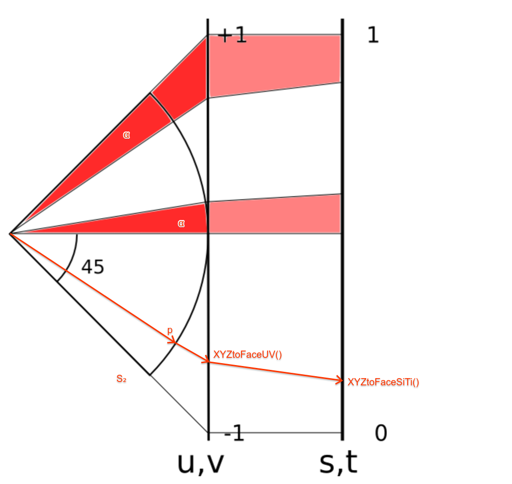

[TOC]

# S2 Cell Hierarchy

The library provides methods for subdividing the sphere into a hierarchical
collection of "cells". The cells have a space-filling curve structure that makes
them useful for spatial indexing. There are methods for approximating arbitrary
regions as a collection of cells.

The S2 cell structure is defined as follows. There are six top-level *face
cells*, obtained by projecting the six faces of a cube -- (face, u, v)
coordinates below -- onto the unit sphere -- (x, y, z) coordinates below. We
call this cube the uv-cube.

Each face is then subdivided recursively into four cells in a quadtree-like
fashion. On the uv-cube, a cell is a rectangle whose edges are aligned with the
sides of its face. On the sphere, it is a spherical quadrilateral bounded by
four geodesics (great circle segments).

There are a total of 30 levels of subdivision defined (i.e. 6 * 4<sup>30</sup>
leaf cells), which gives a resolution of about 1cm everywhere on a sphere the
size of the earth. Details on the cell areas at each level appear on the [S2
Cell Statistics page](cell_statistics.md). Each cell is uniquely identified by a
64-bit *cell id*.

## Coordinate Systems

--------------------------------------------------------------------------------

In order for cells to be roughly the same size on the sphere, they are not the
same size on the uv-cube. We introduce another cube -- the st-cube. On this cube
the cells are perfectly square and divided through their center. The st-cube is
projected on the uv-cube so that cells at the periphery of an st-face are larger
than cells at their center. In a 2-d projection, it looks like this:

<a href="xyz_to_uv_to_st.png">

</a>

There are a few more coordinate systems worth introducing:

*   (id)<br> Cell id.  A 64-bit encoding of a face and a
    Hilbert curve position on that face, as discussed below.  The Hilbert
    curve position implicitly encodes both the position of a cell and its
    subdivision level.

*   (face, i, j)<br> Leaf-cell coordinates.  "i" and "j" are integers in
    the range [0,(2^30)-1] that identify a particular leaf cell on a
    given face.  The (i, j) coordinate system is right-handed on every
    face, and the faces are oriented such that Hilbert curves connect

*   (face, s, t)<br> Cell-space coordinates.  "s" and "t" are real numbers
    in the range [0,1] that identify a point on the given face.  For
    example, the point (s, t) = (0.5, 0.5) corresponds to the center of the
    top-level face cell.  This point is also a vertex of exactly four
    cells at each subdivision level greater than zero.

*   (face, si, ti)<br> Discrete cell-space coordinates.  These are
    obtained by multiplying "s" and "t" by 2^31 and rounding to the
    nearest integer.  Discrete coordinates lie in the range
    [0,2^31].  This coordinate system can represent the edge and
    center positions of all cells with no loss of precision (including
    non-leaf cells).

*   (face, u, v)<br> Cube-space coordinates.  To make the cells at each
    level more uniform in size after they are projected onto the sphere,
    we apply a nonlinear transformation of the form u=f(s), v=f(t), where
    f(s) = (4 s^2 - 1) / 3 if s >= 1/2 and (1 - 4 (1 - s)^2) / 3 if s < 1/2.
    The (u, v) coordinates after this transformation give the actual
    coordinates of a point on the cube face (modulo some 90 degree
    rotations) before it is projected onto the unit sphere.

*   (x, y, z)<br> Direction vector (`S2Point`).  Direction vectors are not
    necessarily unit length, and are often chosen to be points on the
    biunit cube [-1,+1]x[-1,+1]x[-1,+1].  They can be be normalized
    to obtain the corresponding point on the unit sphere.

*   (lat, lng)<br> Latitude and longitude (`S2LatLng`).  Latitudes must be
    between -90 and 90 degrees inclusive, and longitudes must be between
    -180 and 180 degrees inclusive.

Note that the (i, j), (s, t), (si, ti), and (u, v) coordinate systems are
right-handed on all six faces.

Conversion between coordinate systems can lead to precision problems.

## Cell Ids

Cell ids are a convenient representation for both points and regions on the unit
sphere. Points are generally represented as leaf cells, while regions are
represented as collections of cells at any level.

An `S2CellId` is a 64-bit unsigned integer that uniquely identifies a cell in
the S2 cell decomposition. It has the following format:

```
   id = [face][face_pos]
```

where "face" is a 3-bit number (range 0..5) encoding the cube face, and
"face_pos" is a 61-bit number encoding the position of the center of this cell
along a space-filling curve over this face (see below).

In particular, the id of a cell at level "k" consists of a 3-bit face number,
followed by k pairs of bits that recursively select one of the four children of
each cell. The remainder consists of a single 1-bit followed by zeros (this is
the Hilbert curve position corresponding to the center of the cell as discussed
above). For example:

    01010000...0   The top-level cell of face 2.  (The Hilbert curve
                   position 0.10* corresponds to the center of the cell.)
    00110100...0   Subcell 10 of the top-level cell of face 1.

Cell ids have the following convenient properties:

*   The level of a cell id can be determined by looking at the position of its
    lowest-numbered 1-bit. For a cell at level k, the lowest-numbered 1-bit is
    at position 2*(kMaxLevel-k).

*   The id of a parent cell is at the midpoint of the range of ids spanned by
    its children (or by its descendants at any level).

## Cell Id to ST Coordinates

Each cell is a spherical quadrilateral bounded by four geodesics (great circle
segments). The level 0 subdivision (the top level) consists of six face cells.
The children of each face cell are numbered according to their traversal order
along a Hilbert curve.

The canonical Hilbert curve on a cell visits its children in the following (i,j)
order: (0,0), (0,1), (1,1), (1,0). Graphically, the traversal order looks like
an inverted U:

             (0,1) ^----> (1,1)
                   |    |
                   |    |
             (0,0) x    v (1,0)

The traversal order in each subcell is obtained by applying the following
transformations to the ordering in its parent cell:

          (0,0):   (i,j) -> (j,i)       [axes swapped]
          (0,1):   (i,j) -> (i,j)
          (1,1):   (i,j) -> (i,j)
          (1,0):   (i,j) -> (1-j,1-i)   [axes swapped and inverted]

For example, the traversal order in the four subcells of cell (0,0) is (0,0),
(1,0), (1,1), (0,1) (the i- and j-axes have been swapped). After one level of
expansion according to these rules, the curve looks like this:

              ^-->  ^-->
              |  |  |  |
              ^  v-->  v (*)
              |        |
              <--^  <--v
                 |  |
              x-->  v-->

Each leaf cell can be assigned a label according to its position in the
traversal order. For example, the traversal above has 16 positions ranging from
0000 to 1111 in binary notation. The cell marked (*) has the label 1011. Notice
that we can obtain the traversal position of the parent of any cell (within its
own traversal order) by stripping the last two bits from its label.

We typically think of the Hilbert curve position as a real number between 0 and
1, by prefixing "0." to the binary number above. For example, position 0.1000 in
binary (0.5 in decimal) is at the beginning of curve in subcell 10 of the root
cell, which turns out to be the middle of the top-level face. Note that it is
true in general that the Hilbert curve position at the middle of any cell is the
average of the positions at the points where the curve enters and exits that
cell.

A particular cell can be uniquely identified by the Hilbert curve position at
the center of that cell. Note that no two cells have the same center position.
For example, the Hilbert curve position at the center of the top-level face cell
is 0.10* in binary notation (where 0* denotes infinitely many zeroes). The
position at the center of subcell (0,0) of the top-level face cell is 0.0010*.
Note that a Hilbert curve position specifies both the position **and** the
subdivision level of a particular cell.

[Images of the Earth projected onto S2 cells can be found
here.](earthcube/earthcube.md)

## `S2CellId` Class

The `S2CellId` class is a thin wrapper over a 64-bit cell id that provides
methods for navigating the cell hierarchy (finding parents, children,
containment tests, etc). Since leaf cells are often used to represent points on
the unit sphere, the `S2CellId` class also provides methods for converting
directly to and from an `S2Point`. Here are its methods:

```c++
class S2CellId {
 public:
  static const int kFaceBits = 3;
  static const int kNumFaces = 6;
  static const int kMaxLevel = 30;  // Valid levels: 0..kMaxLevel
  static const int kMaxSize = 1 << kMaxLevel;

  // Although only 60 bits are needed to represent the index of a leaf
  // cell, we need an extra bit in order to represent the position of
  // the center of the leaf cell along the Hilbert curve.
  static const int kPosBits = 2 * kMaxLevel + 1;

  explicit S2CellId(uint64 id);

  // The default constructor returns an invalid cell id.
  S2CellId();
  static S2CellId None();

  // Return an invalid cell id guaranteed to be larger than any
  // valid cell id.  Useful for creating indexes.
  static S2CellId Sentinel();

  // Return the cell corresponding to a given S2 cube face.
  static S2CellId FromFace(int face);

  // Return a cell given its face (range 0..5), Hilbert curve position within
  // that face (an unsigned integer with S2CellId::kPosBits bits), and level
  // (range 0..kMaxLevel).  The given position will be modified to correspond
  // to the Hilbert curve position at the center of the returned cell.  This
  // is a static function rather than a constructor in order to indicate what
  // the arguments represent.
  static S2CellId FromFacePosLevel(int face, uint64 pos, int level);

  // Construct a leaf cell containing the given point "p".  Usually there is
  // exactly one such cell, but for points along the edge of a cell, any
  // adjacent cell may be (deterministically) chosen.  This is because
  // S2CellIds are considered to be closed sets.  The returned cell will
  // always contain the given point, i.e.
  //
  //   S2Cell(S2CellId(p)).Contains(p)
  //
  // is always true.  The point "p" does not need to be normalized.
  explicit S2CellId(const S2Point& p);

  // Construct a leaf cell containing the given normalized S2LatLng.
  explicit S2CellId(const S2LatLng& ll);

  // Return the direction vector corresponding to the center of the given
  // cell.  The vector returned by ToPointRaw is not necessarily unit length.
  // This method returns the same result as S2Cell::GetCenter().
  S2Point ToPoint() const;
  S2Point ToPointRaw() const;

  // Return the S2LatLng corresponding to the center of the given cell.
  S2LatLng ToLatLng() const;

  // The 64-bit unique identifier for this cell.
  uint64 id() const;

  // Return true if id() represents a valid cell.
  bool is_valid() const;

  // Which cube face this cell belongs to, in the range 0..5.
  int face() const;

  // The position of the cell center along the Hilbert curve over this face,
  // in the range 0..(2^kPosBits-1).
  uint64 pos() const;

  // Return the subdivision level of the cell (range 0..kMaxLevel).
  int level() const;

  // Return true if this is a leaf cell (more efficient than checking
  // whether level() == kMaxLevel).
  bool is_leaf() const;

  // Return true if this is a top-level face cell (more efficient than
  // checking whether level() == 0).
  bool is_face() const;

  // Return the child position (0..3) of this cell within its parent.
  // REQUIRES: level() >= 1.
  int child_position() const;

  // Return the child position (0..3) of this cell's ancestor at the given
  // level within its parent.  For example, child_position(1) returns the
  // position of this cell's level-1 ancestor within its top-level face cell.
  // REQUIRES: 1 <= level <= this->level().
  int child_position(int level) const;

  // Methods that return the range of cell ids that are contained
  // within this cell (including itself).  The range is *inclusive*
  // (i.e. test using >= and <=) and the return values of both
  // methods are valid leaf cell ids.
  //
  // These methods should not be used for iteration.  If you want to
  // iterate through all the leaf cells, call child_begin(kMaxLevel) and
  // child_end(kMaxLevel) instead.  Also see maximum_tile(), which can be used
  // to iterate through cell ranges using cells at different levels.
  //
  // It would in fact be error-prone to define a range_end() method, because
  // this method would need to return (range_max().id() + 1) which is not
  // always a valid cell id.  This also means that iterators would need to be
  // tested using "<" rather that the usual "!=".
  S2CellId range_min() const;
  S2CellId range_max() const;

  // Return true if the given cell is contained within this one.
  bool contains(S2CellId other) const;

  // Return true if the given cell intersects this one.
  bool intersects(S2CellId other) const;

  // Return the cell at the previous level or at the given level (which must
  // be less than or equal to the current level).
  S2CellId parent() const;
  S2CellId parent(int level) const;

  // Return the immediate child of this cell at the given traversal order
  // position (in the range 0 to 3).  This cell must not be a leaf cell.
  S2CellId child(int position) const;

  // Iterator-style methods for traversing the immediate children of a cell or
  // all of the children at a given level (greater than or equal to the current
  // level).  Note that the end value is exclusive, just like standard STL
  // iterators, and may not even be a valid cell id.  You should iterate using
  // code like this:
  //
  //   for(S2CellId c = id.child_begin(); c != id.child_end(); c = c.next())
  //     ...
  //
  // The convention for advancing the iterator is "c = c.next()" rather
  // than "++c" to avoid possible confusion with incrementing the
  // underlying 64-bit cell id.
  S2CellId child_begin() const;
  S2CellId child_begin(int level) const;
  S2CellId child_end() const;
  S2CellId child_end(int level) const;

  // Return the next/previous cell at the same level along the Hilbert curve.
  // Works correctly when advancing from one face to the next, but
  // does *not* wrap around from the last face to the first or vice versa.
  S2CellId next() const;
  S2CellId prev() const;

  // This method advances or retreats the indicated number of steps along the
  // Hilbert curve at the current level, and returns the new position.  The
  // position is never advanced past End() or before Begin().
  S2CellId advance(int64 steps) const;

  // Return the level of the "lowest common ancestor" of this cell and
  // "other".  Note that because of the way that cell levels are numbered,
  // this is actually the *highest* level of any shared ancestor.  Return -1
  // if the two cells do not have any common ancestor (i.e., they are from
  // different faces).
  int GetCommonAncestorLevel(S2CellId other) const;

  // Iterator-style methods for traversing all the cells along the Hilbert
  // curve at a given level (across all 6 faces of the cube).  Note that the
  // end value is exclusive (just like standard STL iterators), and is not a
  // valid cell id.
  static S2CellId Begin(int level);
  static S2CellId End(int level);

  // Methods to encode and decode cell ids to compact text strings suitable
  // for display or indexing.  Cells at lower levels (i.e. larger cells) are
  // encoded into fewer characters.  The maximum token length is 16.
  //
  // ToToken() returns a string by value for convenience; the compiler
  // does this without intermediate copying in most cases.
  //
  // These methods guarantee that FromToken(ToToken(x)) == x even when
  // "x" is an invalid cell id.  All tokens are alphanumeric strings.
  // FromToken() returns S2CellId::None() for malformed inputs.
  string ToToken() const;
  static S2CellId FromToken(const char* token, size_t length);
  static S2CellId FromToken(const string& token);

  // Creates a debug human readable string. Used for << and available for direct
  // usage as well.
  string ToString() const;

  // Return the four cells that are adjacent across the cell's four edges.
  // Neighbors are returned in the order defined by S2Cell::GetEdge.  All
  // neighbors are guaranteed to be distinct.
  void GetEdgeNeighbors(S2CellId neighbors[4]) const;

  // Return the neighbors of closest vertex to this cell at the given level,
  // by appending them to "output".  Normally there are four neighbors, but
  // the closest vertex may only have three neighbors if it is one of the 8
  // cube vertices.
  //
  // Requires: level < this->level(), so that we can determine which vertex is
  // closest (in particular, level == kMaxLevel is not allowed).
  void AppendVertexNeighbors(int level, std::vector<S2CellId>* output) const;

  // Append all neighbors of this cell at the given level to "output".  Two
  // cells X and Y are neighbors if their boundaries intersect but their
  // interiors do not.  In particular, two cells that intersect at a single
  // point are neighbors.
  //
  // Requires: nbr_level >= this->level().  Note that for cells adjacent to a
  // face vertex, the same neighbor may be appended more than once.
  void AppendAllNeighbors(int nbr_level, std::vector<S2CellId>* output) const;
};
```

See `s2cellid.h` for additional methods.

## `S2Cell` Class

An `S2Cell` is an `S2Region` object that represents a cell. Unlike `S2CellId`,
it views a cell as a representing a spherical quadrilateral rather than a point,
and it supports efficient containment and intersection tests. However, it is
also a more expensive representation (currently 48 bytes rather than 8).

Here are its methods:

```c++
class S2Cell final : public S2Region {
 public:
  // The default constructor is required in order to use freelists.
  // Cells should otherwise always be constructed explicitly.
  S2Cell();

  // An S2Cell always corresponds to a particular S2CellId.  The other
  // constructors are just convenience methods.
  explicit S2Cell(S2CellId id);

  // Convenience constructors.  The S2LatLng must be normalized.
  explicit S2Cell(const S2Point& p);
  explicit S2Cell(const S2LatLng& ll);

  // Return the cell corresponding to the given S2 cube face.
  static S2Cell FromFace(int face);

  // Return a cell given its face (range 0..5), Hilbert curve position within
  // that face (an unsigned integer with S2CellId::kPosBits bits), and level
  // (range 0..kMaxLevel).  The given position will be modified to correspond
  // to the Hilbert curve position at the center of the returned cell.  This
  // is a static function rather than a constructor in order to indicate what
  // the arguments represent.
  static S2Cell FromFacePosLevel(int face, uint64 pos, int level);

  S2CellId id() const;
  int face() const;
  int level() const;
  int orientation() const;
  bool is_leaf() const;

  // Return the k-th vertex of the cell (k = 0,1,2,3).  Vertices are returned
  // in CCW order (lower left, lower right, upper right, upper left in the UV
  // plane).  The points returned by GetVertexRaw are not normalized.
  S2Point GetVertex(int k) const;
  S2Point GetVertexRaw(int k) const;

  // Return the inward-facing normal of the great circle passing through
  // the edge from vertex k to vertex k+1 (mod 4).  The normals returned
  // by GetEdgeRaw are not necessarily unit length.
  S2Point GetEdge(int k) const;
  S2Point GetEdgeRaw(int k) const;

  // If this is not a leaf cell, set children[0..3] to the four children of
  // this cell (in traversal order) and return true.  Otherwise returns false.
  // This method is equivalent to the following:
  //
  // for (pos=0, id=child_begin(); id != child_end(); id = id.next(), ++pos)
  //   children[pos] = S2Cell(id);
  //
  // except that it is more than two times faster.
  bool Subdivide(S2Cell children[4]) const;

  // Return the direction vector corresponding to the center in (s,t)-space of
  // the given cell.  This is the point at which the cell is divided into four
  // subcells; it is not necessarily the centroid of the cell in (u,v)-space
  // or (x,y,z)-space.  The point returned by GetCenterRaw is not necessarily
  // unit length.
  S2Point GetCenter() const;
  S2Point GetCenterRaw() const;

  // Return the average area for cells at the given level.
  static double AverageArea(int level);

  // Return the average area of cells at this level.  This is accurate to
  // within a factor of 1.7 (for S2_QUADRATIC_PROJECTION) and is extremely
  // cheap to compute.
  double AverageArea() const;

  // Return the approximate area of this cell.  This method is accurate to
  // within 3% percent for all cell sizes and accurate to within 0.1% for
  // cells at level 5 or higher (i.e. squares 350km to a side or smaller
  // on the Earth's surface).  It is moderately cheap to compute.
  double ApproxArea() const;

  // Return the area of this cell as accurately as possible.  This method is
  // more expensive but it is accurate to 6 digits of precision even for leaf
  // cells (whose area is approximately 1e-18).
  double ExactArea() const;

  // Return the distance from the cell to the given point.  Returns zero if
  // the point is inside the cell.
  S1ChordAngle GetDistance(const S2Point& target) const;

  // Return the distance from the cell boundary to the given point.
  S1ChordAngle GetBoundaryDistance(const S2Point& target) const;

  // Return the minimum distance from the cell to the given edge AB.  Returns
  // zero if the edge intersects the cell interior.
  S1ChordAngle GetDistance(const S2Point& a, const S2Point& b) const;

  ////////////////////////////////////////////////////////////////////////
  // S2Region interface (see s2region.h for details):

  S2Cell* Clone() const override;
  S2Cap GetCapBound() const override;
  S2LatLngRect GetRectBound() const override;
  bool Contains(const S2Cell& cell) const override;
  bool MayIntersect(const S2Cell& cell) const override;

  // Return true if the cell contains the given point "p".  Note that unlike
  // S2Loop/S2Polygon, S2Cells are considered to be closed sets.  This means
  // that points along an S2Cell edge (or at a vertex) belong to the adjacent
  // cell(s) as well.
  //
  // If instead you want every point to be contained by exactly one S2Cell,
  // you will need to convert the S2Cells to S2Loops (which implement point
  // containment this way).
  //
  // The point "p" does not need to be normalized.
  bool Contains(const S2Point& p) const override;
};
```

See `s2cell.h` for additional methods.

## Cell Unions

An `S2CellUnion` is an `S2Region` consisting of cells of various sizes. A cell
union is typically used to approximate some other shape. There is a tradeoff
between the accuracy of the approximation and how many cells are used. Unlike
polygons, cells have a fixed hierarchical structure. This makes them more
suitable for spatial indexing.

An `S2CellUnion` is represented as a vector of sorted, non-overlapping
`S2CellIds`.  By default the vector is also "normalized", meaning that groups
of 4 child cells have been replaced by their parent cell whenever possible.
S2CellUnions are not required to be normalized, but certain operations will
return different results if they are not (e.g., `Contains(S2CellUnion)`.)

Here is the interface:

```c++
class S2CellUnion final : public S2Region {
 public:
  // Creates an empty cell union.
  S2CellUnion() {}

  // Constructs a cell union with the given S2CellIds, then calls Normalize()
  // to sort them, remove duplicates, and merge cells when possible.  (See
  // FromNormalized if your vector is already normalized.)
  //
  // The argument is passed by value, so if you are passing a named variable
  // and have no further use for it, consider using std::move().
  //
  // A cell union containing a single S2CellId may be constructed like this:
  //
  //     S2CellUnion example({cell_id});
  explicit S2CellUnion(std::vector<S2CellId> cell_ids);

  // Convenience constructor that accepts a vector of uint64.  Note that
  // unlike the constructor above, this one makes a copy of "cell_ids".
  explicit S2CellUnion(const std::vector<uint64>& cell_ids);

  // Constructs a cell union from S2CellIds that have already been normalized
  // (typically because they were extracted from another S2CellUnion).
  //
  // The argument is passed by value, so if you are passing a named variable
  // and have no further use for it, consider using std::move().
  //
  // REQUIRES: "cell_ids" satisfies the requirements of IsNormalized().
  static S2CellUnion FromNormalized(std::vector<S2CellId> cell_ids);

  // Constructs a cell union from a vector of sorted, non-overlapping
  // S2CellIds.  Unlike the other constructors, FromVerbatim does not require
  // that groups of 4 child cells have been replaced by their parent cell.  In
  // other words, "cell_ids" must satisfy the requirements of IsValid() but
  // not necessarily IsNormalized().
  //
  // Note that if the cell union is not normalized, certain operations may
  // return different results (e.g., Contains(S2CellUnion)).
  //
  // REQUIRES: "cell_ids" satisfies the requirements of IsValid().
  static S2CellUnion FromVerbatim(std::vector<S2CellId> cell_ids);

  // Constructs a cell union that corresponds to a continuous range of cell
  // ids.  The output is a normalized collection of cell ids that covers the
  // leaf cells between "min_id" and "max_id" inclusive.
  //
  // REQUIRES: min_id.is_leaf(), max_id.is_leaf(), min_id <= max_id.
  static S2CellUnion FromMinMax(S2CellId min_id, S2CellId max_id);

  // Like FromMinMax() except that the union covers the range of leaf cells
  // from "begin" (inclusive) to "end" (exclusive), as with Python ranges or
  // STL iterator ranges.  If (begin == end) the result is empty.
  //
  // REQUIRES: begin.is_leaf(), end.is_leaf(), begin <= end.
  static S2CellUnion FromBeginEnd(S2CellId begin, S2CellId end);

  // Clears the contents of the cell union and minimizes memory usage.
  void Clear();

  // Gives ownership of the vector data to the client without copying, and
  // clears the content of the cell union.  The original data in cell_ids
  // is lost if there was any.
  std::vector<S2CellId> Release();

  // Convenience methods for accessing the individual cell ids.
  int num_cells() const;
  S2CellId cell_id(int i) const;

  // Vector-like methods for accessing the individual cell ids.
  size_t size() const;
  bool empty() const;
  S2CellId operator[](int i) const;

  // Direct access to the underlying vector for STL algorithms.
  const std::vector<S2CellId>& cell_ids() const;

  // Returns true if the cell union is valid, meaning that the S2CellIds are
  // valid, non-overlapping, and sorted in increasing order.
  bool IsValid() const;

  // Returns true if the cell union is normalized, meaning that it is
  // satisfies IsValid() and that no four cells have a common parent.
  // Certain operations such as Contains(S2CellUnion) will return a different
  // result if the cell union is not normalized.
  bool IsNormalized() const;

  // Normalizes the cell union by discarding cells that are contained by other
  // cells, replacing groups of 4 child cells by their parent cell whenever
  // possible, and sorting all the cell ids in increasing order.  Returns true
  // if the number of cells was reduced.
  bool Normalize();

  // Replaces "output" with an expanded version of the cell union where any
  // cells whose level is less than "min_level" or where (level - min_level)
  // is not a multiple of "level_mod" are replaced by their children, until
  // either both of these conditions are satisfied or the maximum level is
  // reached.
  //
  // This method allows a covering generated by S2RegionCoverer using
  // min_level() or level_mod() constraints to be stored as a normalized cell
  // union (which allows various geometric computations to be done) and then
  // converted back to the original list of cell ids that satisfies the
  // desired constraints.
  void Denormalize(int min_level, int level_mod,
                   std::vector<S2CellId>* output) const;

  // If there are more than "excess" elements of the cell_ids() vector that
  // are allocated but unused, reallocate the array to eliminate the excess
  // space.  This reduces memory usage when many cell unions need to be held
  // in memory at once.
  void Pack(int excess = 0);

  // Return true if the cell union contains the given cell id.  Containment is
  // defined with respect to regions, e.g. a cell contains its 4 children.
  // This is a fast operation (logarithmic in the size of the cell union).
  bool Contains(S2CellId id) const;

  // Return true if the cell union intersects the given cell id.
  // This is a fast operation (logarithmic in the size of the cell union).
  bool Intersects(S2CellId id) const;

  // Return true if this cell union contain/intersects the given other cell
  // union.
  bool Contains(const S2CellUnion& y) const;
  bool Intersects(const S2CellUnion& y) const;

  // Returns the union of the two given cell unions.
  S2CellUnion Union(const S2CellUnion& y) const;

  // Returns the intersection of the two given cell unions.
  S2CellUnion Intersection(const S2CellUnion& y) const;

  // Specialized version of GetIntersection() that returns the intersection of
  // a cell union with an S2CellId.  This can be useful for splitting a cell
  // union into pieces.
  S2CellUnion Intersection(S2CellId id) const;

  // Returns the difference of the two given cell unions.
  S2CellUnion Difference(const S2CellUnion& y) const;

  // Expands the cell union by adding a "rim" of cells on expand_level
  // around the union boundary.
  //
  // For each cell c in the union, we add all cells at level
  // expand_level that abut c.  There are typically eight of those
  // (four edge-abutting and four sharing a vertex).  However, if c is
  // finer than expand_level, we add all cells abutting
  // c.parent(expand_level) as well as c.parent(expand_level) itself,
  // as an expand_level cell rarely abuts a smaller cell.
  //
  // Note that the size of the output is exponential in
  // "expand_level".  For example, if expand_level == 20 and the input
  // has a cell at level 10, there will be on the order of 4000
  // adjacent cells in the output.  For most applications the
  // Expand(min_radius, max_level_diff) method below is easier to use.
  void Expand(int expand_level);

  // Expand the cell union such that it contains all points whose distance to
  // the cell union is at most "min_radius", but do not use cells that are
  // more than "max_level_diff" levels higher than the largest cell in the
  // input.  The second parameter controls the tradeoff between accuracy and
  // output size when a large region is being expanded by a small amount
  // (e.g. expanding Canada by 1km).  For example, if max_level_diff == 4 the
  // region will always be expanded by approximately 1/16 the width of its
  // largest cell.  Note that in the worst case, the number of cells in the
  // output can be up to 4 * (1 + 2 ^ max_level_diff) times larger than the
  // number of cells in the input.
  void Expand(S1Angle min_radius, int max_level_diff);

  // The number of leaf cells covered by the union.
  // This will be no more than 6*2^60 for the whole sphere.
  uint64 LeafCellsCovered() const;

  // Approximate this cell union's area by summing the average area of
  // each contained cell's average area, using the AverageArea method
  // from the S2Cell class.
  //
  // NOTE: Since this is proportional to LeafCellsCovered(), it is
  // always better to use the other function if all you care about is
  // the relative average area between objects.
  double AverageBasedArea() const;

  // Calculate this cell union's area by summing the approximate area for each
  // contained cell, using the ApproxArea method from the S2Cell class.
  double ApproxArea() const;

  // Calculate this cell union's area by summing the exact area for each
  // contained cell, using the Exact method from the S2Cell class.
  double ExactArea() const;

  // Return true if two cell unions are identical.
  friend bool operator==(const S2CellUnion& x, const S2CellUnion& y);

  // Return true if two cell unions are different.
  friend bool operator!=(const S2CellUnion& x, const S2CellUnion& y);

  ////////////////////////////////////////////////////////////////////////
  // S2Region interface (see s2region.h for details):

  S2CellUnion* Clone() const override;
  S2Cap GetCapBound() const override;
  S2LatLngRect GetRectBound() const override;
  bool Contains(const S2Cell& cell) const override;
  bool MayIntersect(const S2Cell& cell) const override;

  // The point 'p' does not need to be normalized.
  // This is a fast operation (logarithmic in the size of the cell union).
  bool Contains(const S2Point& p) const override;

  // Appends a serialized representation of the S2CellUnion to "encoder".
  void Encode(Encoder* const encoder) const;

  // Decodes an S2CellUnion encoded with Encode().  Returns true on success.
  bool Decode(Decoder* const decoder);

};
```

## Approximating Regions

An `S2RegionCoverer` is a class that allows arbitrary regions to be approximated
as unions of cells (`S2CellUnion`). This is useful for implementing various
sorts of search and precomputation operations.

Typical usage:

    S2RegionCoverer::Options options;
    options.set_max_cells(5);
    S2RegionCoverer coverer(options);
    S2Cap cap(center, radius);
    S2CellUnion covering = coverer.GetCovering(cap);

The result is a cell union of at most 5 cells that is guaranteed to cover the
given cap (a disc-shaped region on the sphere).

The approximation algorithm is not optimal but does a pretty good job in
practice. The output does not always use the maximum number of cells allowed,
both because this would not always yield a better approximation, and because
`max_cells()` is a limit on how much work is done exploring the possible
covering as well as a limit on the final output size.

The default `max_cells()` value of 8 is a reasonable point on the
precision/performance tradeoff curve for caps, but you may want to use higher
values for odd-shaped regions, such as long skinny lat-lng rects. [Here are some
examples of approximations.](coverer/coverer.md)

Here is the interface of `S2RegionCoverer`:

```c++
class S2RegionCoverer {
 public:
  class Options {
   public:
    // Sets the desired maximum number of cells in the approximation.  Note
    // that min_level() takes priority over max_cells(), i.e. cells below the
    // given level will never be used even if this causes a large number of
    // cells to be returned.
    //
    // Accuracy is measured by dividing the area of the covering by the area
    // of the original region.  The following table shows the median and worst
    // case values for this area ratio on a test case consisting of 100,000
    // spherical caps of random size (generated using s2regioncoverer_test):
    //
    //   max_cells:        3      4     5     6     8    12    20   100   1000
    //   median ratio:  5.33   3.32  2.73  2.34  1.98  1.66  1.42  1.11   1.01
    //   worst case:  215518  14.41  9.72  5.26  3.91  2.75  1.92  1.20   1.02
    //
    // The default value of 8 gives a reasonable tradeoff between the number
    // of cells used and the accuracy of the approximation.
    //
    // DEFAULT: kDefaultMaxCells
    static constexpr int kDefaultMaxCells = 8;
    int max_cells() const;
    void set_max_cells(int max_cells);

    // Sets the minimum and maximum cell levels to be used.  The default is to
    // use all cell levels.
    //
    // To find the cell level corresponding to a given physical distance, use
    // the S2Cell metrics defined in s2metrics.h.  For example, to find the
    // cell level that corresponds to an average edge length of 10km, use:
    //
    //   int level =
    //       S2::kAvgEdge.GetClosestLevel(S2Earth::KmToRadians(length_km));
    //
    // Note that min_level() takes priority over max_cells(), i.e. cells below
    // the given level will never be used even if this causes a large number
    // of cells to be returned.
    //
    // REQUIRES: max_level() >= min_level()
    // DEFAULT: 0
    int min_level() const;
    void set_min_level(int min_level);

    // DEFAULT: S2CellId::kMaxLevel
    int max_level() const;
    void set_max_level(int max_level);

    // Convenience function that sets both the maximum and minimum cell levels.
    void set_fixed_level(int level);

    // If specified, then only cells where (level - min_level) is a multiple
    // of "level_mod" will be used (default 1).  This effectively allows the
    // branching factor of the S2CellId hierarchy to be increased.  Currently
    // the only parameter values allowed are 1, 2, or 3, corresponding to
    // branching factors of 4, 16, and 64 respectively.
    //
    // DEFAULT: 1
    int level_mod() const;
    void set_level_mod(int level_mod);
  };

  // Constructs an S2RegionCoverer with the given options.
  explicit S2RegionCoverer(const Options& options);

  // Default constructor.  Options can be set using mutable_options().
  S2RegionCoverer();
  ~S2RegionCoverer();

  // Returns the current options.  Options can be modifed between calls.
  const Options& options() const;
  Options* mutable_options();

  // Returns an S2CellUnion that covers (GetCovering) or is contained within
  // (GetInteriorCovering) the given region and satisfies the current options.
  //
  // Note that if options().min_level() > 0 or options().level_mod() > 1, the
  // by definition the S2CellUnion may not be normalized, i.e. there may be
  // groups of four child cells that can be replaced by their parent cell.
  S2CellUnion GetCovering(const S2Region& region);
  S2CellUnion GetInteriorCovering(const S2Region& region);
};
```

## Appendix: Alternatives Considered

The S2 subdivision scheme has a number of advantages over the Hierarchical
Triangular Mesh (http://skyserver.org/HTM) framework:

*   Converting from a cell id to a point or vice versa is about 100 times faster
    than the corresponding HTM operation. For example, a unit vector can be
    converted to an S2CellId in about 0.15 microseconds, while converting a unit
    vector to an HTM triangle id takes about 25 microseconds. Similarly,
    converting an S2CellId to a vector takes about 0.04 microseconds, while the
    same HTM operation takes about 19 microseconds. (If full resolution is not
    needed, the HTM times can be improved by using fewer levels -- e.g. by using
    15 levels rather than 30, conversions are about twice as fast, but the
    maximum resolution is reduced from 1cm to about 300 meters. The S2 library
    is still about 100 times faster, though.)

*   The S2 library has no storage requirements. In contrast, the HTM library
    precomputes the upper levels of the mesh during initialization to get even
    the performance numbers mentioned above. Computing the first 6 levels (the
    default) takes about 2MB of memory and 5 milliseconds. It is not practical
    to precompute much more than this because memory requirements increase by a
    factor of 4 for each additional level.

*   A linear scan of a set of S2CellIds follows a space-filling curve, which
    maximizes locality of reference. For example, if each cell id is looked up
    in a spatial index of some sort, a space-filling curve minimizes the number
    of times that we switch from one index element to the next. In theory this
    should help cache performance (including non-local caches such as BigTable).
    A linear scan through HTM triangles also has fairly good locality of
    reference due to the hierarchical structure, but it does not define a
    space-filling curve (due to the triangle ordering chosen by its inventors)
    and therefore the locality of reference is not quite as good. (At any given
    level, the HTM path is about 2.2 times longer than the corresonding S2CellId
    path.)

Another alternative is HEALPix
[http://www.eso.org/science/healpix](http://www.eso.org/science/healpix). The
main advantage of HEALPix is that it is suitable for calculations involving
spherical harmonics. This isn't relevant to any of our current applications, and
the scheme otherwise has several disadvantages from our point of view (e.g. cell
boundaries are not geodesics, base structure is more complicated).

The COBE quadrilateralized spherical cube projection
(http://lambda.gsfc.nasa.gov/product/cobe/skymap_info_new.cfm) also starts by
projecting the six faces of a cube onto the unit sphere, and subdivides each
face in a quadtree fashion. However, it does not use a space-filling curve
scheme for labelling the cells, the cell edges are not geodesics, and it uses a
much more complicated projection scheme designed to minimize distortion.
