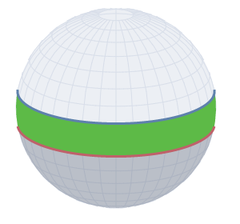
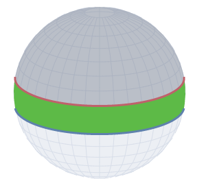
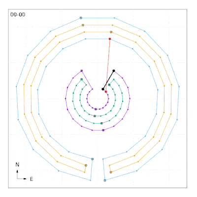

## Overview

`S2ShapeNestingQuery` is a query to divide the chains of an `S2Shape` into
either "shells", which are analogous to exterior rings in non-spherical
geometry, or "holes" which are contained by a shell.

Shells never have a parent of their own, and may have zero or more holes in
them, while holes always have a single parent and never have holes of their own.

Since we operate in spherical coordinates, the relationship between chains is
ambiguous. If you imagine a band around the equator, we can consider the
northern chain to be a shell and the southern chain to be a hole:



Or, equivalently, we can reverse that ordering and consider the southern edge to
be the shell:



To resolve this ambiguity, we have to specify one chain of the shape to be a
shell by definition, with the other chains classified in relation to it. We
refer to this shell as the *datum* shell, and the exact method we use to choose
it is given by an `S2DatumStrategy` which can be provided through the
`S2ShapeNestingQueryOptions` passed to the query. The default strategy is to use
the *first* chain in the shape as the datum shell.

## Usage

Assuming we have an `S2ShapeIndex` called `index`, and we're interested in the
shape at index 3:

```c++
S2ShapeNestingQuery nesting_query(&index);
vector<S2ShapeNestingQuery::ChainRelation> relations = nesting_query.ShapeNesting(3);
```

The entries of `relations` are a 1:1 mapping with the chains in the shape. Thus,
`relations[2]` corresponds to chain 2 in shape 3. The `ChainRelation` class
itself provides information on the relationships between a given chain and other
chains, and whether a chain is a shell or a hole.

As a concrete example, GeoJSON requires that each polygon have one shell and
zero or more holes. With the chain relationship information, we can easily scan
through our geometry and write it out as GeoJSON properly:

```c++
S2ShapeNestingQuery nesting_query(&index);
vector<S2ShapeNestingQuery::ChainRelation> relations = nesting_query.ShapeNesting(3);

for (int chain = 0; chain < relations.size(); chain++)
  const ChainRelation relation& = relations[chain];
  if (relation.IsShell()) {
    auto polygon = GeoJsonPolygon(chain)
    for (int hole : relation.Holes()) {
      polygon.AddHole(hole);
    }
    WriteGeoJsonPolygon(polygon);
 }
}
```


To perform chain classification, we use the fact that we have one chain that we
know *a priori* is a shell (via the datum strategy). We take a point on that
shell (the exact one doesn't matter), and draw a line to a random point on each
of the other chains.

We look up the edges that are crossed by that line and keep track of potential
parents as a bit vector with one entry per chain. Every time we cross an edge,
we determine the chain it belongs to, and toggle that bit.

When we've done that, we may have multiple possible parents for a given chain,
so we have to do a reduction step which looks like this:

```
for each chain0 with exactly one parent:
   for each chain1:
     if both chain0,parent in parents of chain1:
        unset parent in parents of chain1
```

This says that, if we know that A ⊃ B, and B ⊃ C, then C shouldn't *directly*
consider A as a possible parent.

Lastly, we determine each chain's depth from its root parent, and chains that
are at an even depth have their parent link broken and thus become shells.

To help visualize, this animation shows a test running to classify four very
concave nested chains. Chain 2 (blue) is being classified by drawing edges from
chain 0 (purple). The edge between the two points is show in red and intersected
edges are highlighted. To test the robustness of the algorithm, the test is run
multiple times, rotating the order of the vertices in the chains each time.


