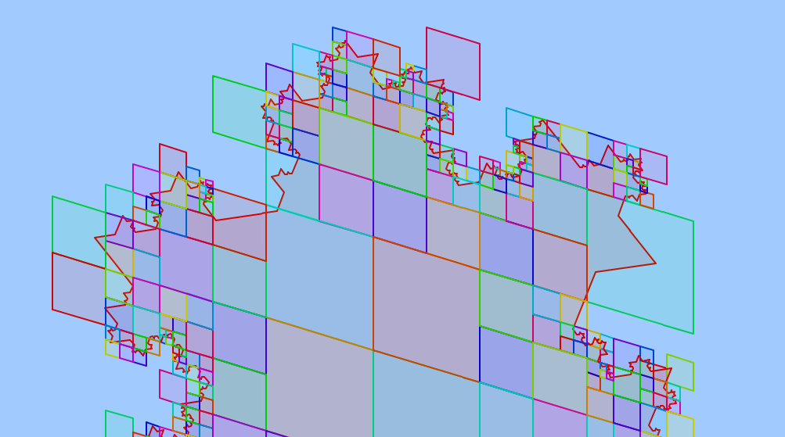

## Overview

`S2ShapeIndex` is an abstract base class for indexing polygonal geometry
in memory.  The objects in the index are known as "shapes", and may
consist of points, polylines, and/or polygons, possibly overlapping.  The
index makes it very fast to answer queries such as finding nearby shapes,
measuring distances, testing for intersection and containment, etc.

Each object in the index implements the `S2Shape` interface.  An `S2Shape`
is a collection of edges that optionally defines an interior.  The edges do
not need to be connected, so for example an `S2Shape` can represent a
polygon with multiple shells and/or holes, or a set of polylines, or a set
of points.  All geometry within a single `S2Shape` must have the same
dimension, so for example if you want to create an `S2ShapeIndex` containing
a polyline and 10 points, then you will need at least two different shapes.

There are a number of built-in classes that work with `S2ShapeIndex`
objects.  Generally these classes are designed to work with any collection
of geometry that can be represented by an `S2ShapeIndex`, i.e. any
combination of points, polylines, and polygons.  Such classes include:

*   [`S2ContainsPointQuery`](#s2containspointquery): returns the shape(s)
    that contain a given point.
*   [`S2ClosestEdgeQuery`](s2closestedgequery): returns the closest edge(s)
    to a given point, edge, `S2CellId`, or `S2ShapeIndex`.
*   `S2CrossingEdgeQuery`: returns the edge(s) that cross a given edge.
*   `S2BooleanOperation`: computes boolean operations such as union, and
    boolean predicates such as containment.
*   `S2ShapeIndexRegion`: computes approximations for a collection of
    geometry.
*   `S2ShapeIndexBufferedRegion`: computes approximations that have been
    expanded by a given radius.

## Example

Here is an example showing how to index a set of polygons and then
determine which polygon(s) contain each of a set of query points:

    void TestContainment(const vector<S2Point>& points,
                         const vector<S2Polygon*>& polygons) {
      MutableS2ShapeIndex index;
      for (auto polygon : polygons) {
        index.Add(absl::make_unique<S2Polygon::Shape>(polygon));
      }
      auto query = MakeS2ContainsPointQuery(&index);
      for (const auto& point: points) {
        for (S2Shape* shape : query.GetContainingShapes(point)) {
          S2Polygon* polygon = polygons[shape->id()];
          ... do something with (point, polygon) ...
        }
      }
    }

This example uses `S2Polygon::Shape`, which is one example of an `S2Shape`
object.  `S2Polyline` and `S2Loop` also have nested `Shape` classes, and
there are additional `S2Shape` types defined in `*_shape.h`.

## S2Shape

The purpose of `S2Shape` is to represent polygonal geometry in a flexible
way.  It is organized as a collection of edges that optionally defines an
interior.  All geometry represented by an `S2Shape` must have the same
dimension, which means that an `S2Shape` can represent either a set of
points, a set of polylines, or a set of polygons.

`S2Shape` is defined as an abstract base class in order to give clients
control over the underlying data representation.  Sometimes an `S2Shape`
does not have any data of its own, but instead "wraps" some other class.
For example, `S2Polygon::Shape` wraps an `S2Polygon` object.  Here are a
few commonly used types of `S2Shape`:

`S2Polygon::Shape`
: a polygon

`S2LaxPolygonShape`
: a polygon, possibly with degeneracies

`S2Polyline::Shape`
: a polyline

`S2LaxPolylineShape`
: a polyline, possibly with degeneracies

`S2PointVectorShape`
: a collection of points

`S2EdgeVectorShape`
: a collection of edges

Some classes such as `S2Polygon` have a nested `Shape` class, and others
are defined as standalone objects.  It is also easy for clients to
implement their own subtypes, since the `S2Shape` interface is fairly
minimal (see below).

The edges of an `S2Shape` are identified by a contiguous range of *edge
ids* starting at 0.  The edges are further subdivided into *chains*, where
each chain consists of a sequence of edges connected end-to-end (a
polyline).  For example, an `S2Shape` representing two polylines AB and CDE
would have three edges (AB, CD, DE) grouped into two chains: (AB) and (CD,
DE).  Similarly, an `S2Shape` representing 5 points would have 5 chains
consisting of one edge each.

Each chain is represented by a contiguous range of edge ids with no gaps
between chains.  Edges can be accessed using either the global numbering
(edge id) or a (chain_id, offset) pair.  The global numbering is sufficient
for most purposes, but the chain representation is useful for some
algorithms such as polygon operations (see `S2BooleanOperation`).

Here are the most important methods of the `S2Shape` interface:

```c++
class S2Shape {
 public:
  // An edge, consisting of two vertices "v0" and "v1".  Zero-length edges are
  // allowed, and can be used to represent points.
  struct Edge {
    S2Point v0, v1;
    Edge();
    Edge(const S2Point& _v0, const S2Point& _v1);
    friend bool operator==(const Edge& x, const Edge& y);
    friend bool operator<(const Edge& x, const Edge& y);
  };

  S2Shape();
  virtual ~S2Shape();

  // Returns the number of edges in this shape.  Edges have ids ranging from 0
  // to num_edges() - 1.
  virtual int num_edges() const = 0;

  // Returns the endpoints of the given edge id.
  //
  // REQUIRES: 0 <= id < num_edges()
  virtual Edge edge(int edge_id) const = 0;

  // Returns the dimension of the geometry represented by this shape.
  //
  //  0 - Point geometry.  Each point is represented as a degenerate edge.
  //
  //  1 - Polyline geometry.  Polyline edges may be degenerate.  A shape may
  //      represent any number of polylines.  Polylines edges may intersect.
  //
  //  2 - Polygon geometry.  Edges should be oriented such that the polygon
  //      interior is always on the left.  In theory the edges may be returned
  //      in any order, but typically the edges are organized as a collection
  //      of edge chains where each chain represents one polygon loop.
  //      Polygons may have degeneracies (e.g., degenerate edges or sibling
  //      pairs consisting of an edge and its corresponding reversed edge).
  //
  // Note that this method allows degenerate geometry of different dimensions
  // to be distinguished, e.g. it allows a point to be distinguished from a
  // polyline or polygon that has been simplified to a single point.
  virtual int dimension() const = 0;

  // A unique id assigned to this shape by S2ShapeIndex.  Shape ids are
  // assigned sequentially starting from 0 in the order shapes are added.
  int id() const { return id_; }
};
```

The additional methods related to edge chains are summarized below:

```c++
  // A range of edge ids corresponding to a chain of zero or more connected
  // edges, specified as a (start, length) pair.  The chain is defined to
  // consist of edge ids {start, start + 1, ..., start + length - 1}.
  struct Chain {
    int32 start, length;
    Chain();
    Chain(int32 _start, int32 _length);
  };

  // The position of an edge within a given edge chain, specified as a
  // (chain_id, offset) pair.  Chains are numbered sequentially starting from
  // zero, and offsets are measured from the start of each chain.
  struct ChainPosition {
    int32 chain_id, offset;
    ChainPosition();
    ChainPosition(int32 _chain_id, int32 _offset);
  };

  // Returns the number of contiguous edge chains in the shape.  For example,
  // a shape whose edges are [AB, BC, CD, AE, EF] would consist of two chains
  // (AB,BC,CD and AE,EF).  Every chain is assigned a "chain id" numbered
  // sequentially starting from zero.
  //
  // Note that it is always acceptable to implement this method by returning
  // num_edges() (i.e. every chain consists of a single edge), but this may
  // reduce the efficiency of some algorithms.
  virtual int num_chains() const = 0;

  // Returns the range of edge ids corresponding to the given edge chain.  The
  // edge chains must form contiguous, non-overlapping ranges that cover the
  // entire range of edge ids.  This is spelled out more formally below:
  //
  // REQUIRES: 0 <= i < num_chains()
  // REQUIRES: chain(i).length >= 0, for all i
  // REQUIRES: chain(0).start == 0
  // REQUIRES: chain(i).start + chain(i).length == chain(i+1).start,
  //           for i < num_chains() - 1
  // REQUIRES: chain(i).start + chain(i).length == num_edges(),
  //           for i == num_chains() - 1
  virtual Chain chain(int chain_id) const = 0;

  // Returns the edge at offset "offset" within edge chain "chain_id".
  // Equivalent to "shape.edge(shape.chain(chain_id).start + offset)"
  // but may be more efficient.
  virtual Edge chain_edge(int chain_id, int offset) const = 0;

  // Finds the chain containing the given edge, and returns the position of
  // that edge as a (chain_id, offset) pair.
  //
  // REQUIRES: shape.chain(pos.chain_id).start + pos.offset == edge_id
  // REQUIRES: shape.chain(pos.chain_id + 1).start > edge_id
  //
  // where     pos == shape.chain_position(edge_id).
  virtual ChainPosition chain_position(int edge_id) const = 0;
```

### S2Shape vs. S2Region

It is worth pointing out that S2 defines two extensible interfaces for
representing geometry: `S2Shape` and `S2Region`.  They can be compared as
follows:

*   The purpose of `S2Shape` is to flexibly represent polygonal geometry.
    (This includes not only polygons, but also points and polylines.)  Most of
    the core S2 operations will work with any class that implements the
    `S2Shape` interface.

*   The purpose of `S2Region` is to compute approximations for geometry.  For
    example, there are methods for computing bounding rectangles and discs,
    and `S2RegionCoverer` can be used to approximate a region to any desired
    accuracy as a collection of cells.  Unlike `S2Shape`, an `S2Region` may
    represent non-polygonal geometry such as discs (`S2Cap`).

## MutableS2ShapeIndex

The most important subtype of `S2ShapeIndex` is `MutableS2ShapeIndex`.
This class allows not only building an index but also updating it
incrementally by adding or removing shapes.  Its major methods are as
follows:

```c++
class MutableS2ShapeIndex final : public S2ShapeIndex {
 public:
  // Create an S2ShapeIndex that uses the default option settings.
  S2ShapeIndex();
  ~S2ShapeIndex();

  // Takes ownership of the given shape and adds it to the index.  Also assigns
  // a unique id to the shape (shape->id()) and returns that id.  Shape ids
  // are assigned sequentially starting from 0 in the order shapes are added.
  // Invalidates all iterators and their associated data.
  int Add(std::unique_ptr<S2Shape> shape);

  // Removes the given shape from the index and return ownership to the caller.
  // Invalidates all iterators and their associated data.
  std::unique_ptr<S2Shape> Release(int shape_id);

  // Resets the index to its original state and returns ownership of all
  // shapes to the caller.  This method is more efficient than removing
  // all shapes one at a time.
  std::vector<std::unique_ptr<S2Shape>> ReleaseAll();

  // Resets the index to its original state and deletes all shapes.
  void Clear();

  // The number of distinct shape ids that have been assigned.  This equals
  // the number of shapes in the index provided that no shapes have ever been
  // removed.  (Shape ids are not reused.)
  int num_shape_ids() const override;

  // Returns a pointer to the shape with the given id, or nullptr if the shape
  // has been removed from the index.
  S2Shape* shape(int id) const override;

  // Returns the number of bytes currently occupied by the index (including any
  // unused space at the end of vectors, etc). It has the same thread safety
  // as the other "const" methods (see introduction).
  size_t SpaceUsed() const;

  // Minimizes memory usage by requesting that any data structures that can be
  // rebuilt should be discarded.  This method invalidates all iterators.
  //
  // Like all non-const methods, this method is not thread-safe.
  void Minimize() override;
};
```

One important feature to be aware of is that updates are batched together
and applied lazily on the first subsequent query.  This is important for
efficiency, and also means that we can avoid building the index entirely
when in fact there is no subsequent query.

Note that even though updates are applied lazily, `MutableS2ShapeIndex` has
the same thread-safety properties as `vector`: const methods are
thread-safe, while non-const methods are not thread-safe.  In other words,
no additional locking is required for multi-threaded read access.

## S2ContainsPointQuery

`S2ContainsPointQuery` is an example of a class that is designed to
work with `S2ShapeIndex`.  It has methods to find the shapes and/or
edges that contain a given point.  Here is an example showing how to
use it:

    S2ContainsPointQueryOptions options(S2VertexModel::CLOSED);
    auto query = MakeS2ContainsPointQuery(&index, options);
    if (query.Contains(point)) {
      ... at least one shape contains "point" ...
    }

Other methods of `S2ContainsPointQuery` allow finding the set of shapes
containing a given point, visiting the edges incident to a given point,
etc.

Note that because most of its methods are very fast, `S2ContainsPointQuery`
takes the `S2ShapeIndex` type as a template argument.  This allows the
overhead of virtual method calls to be eliminated when the actual subtype
is known.  `MakeS2ContainsPointQuery` is a convenience function that
constructs an instance appropriate for the given `S2ShapeIndex` argument:

```c++
template <class IndexType>
inline S2ContainsPointQuery<IndexType> MakeS2ContainsPointQuery(
    const IndexType* index,
    const S2ContainsPointQueryOptions& options = S2ContainsPointQueryOptions());
```

By default, polygon boundaries are modeled as *semi-open*, which means that
if several polygons tile the region around a shared vertex, then exactly
one of those polygons contains that vertex.  If other behavior is desired,
it can be specified as follows:

```c++
// Defines whether shapes are considered to contain their vertices.  Note that
// these definitions differ from the ones used by S2BooleanOperation.
//
//  - In the OPEN model, no shapes contain their vertices (not even points).
//    Therefore Contains(S2Point) returns true if and only if the point is
//    in the interior of some polygon.
//
//  - In the SEMI_OPEN model, polygon point containment is defined such that
//    if several polygons tile the region around a vertex, then exactly one of
//    those polygons contains that vertex.  Points and polylines still do not
//    contain any vertices.
//
//  - In the CLOSED model, all shapes contain their vertices (including points
//    and polylines).
//
// Note that points other than vertices are never contained by polylines.
// If you want need this behavior, use S2ClosestEdgeQuery::IsDistanceLess()
// with a suitable distance threshold instead.
enum class S2VertexModel { OPEN, SEMI_OPEN, CLOSED };

// This class defines the options supported by S2ContainsPointQuery.
class S2ContainsPointQueryOptions {
 public:
  S2ContainsPointQueryOptions() {}

  // Convenience constructor that sets the vertex_model() option.
  explicit S2ContainsPointQueryOptions(S2VertexModel vertex_model);

  // Controls whether shapes are considered to contain their vertices (see
  // definitions above).  By default the SEMI_OPEN model is used.
  //
  // DEFAULT: S2VertexModel::SEMI_OPEN
  S2VertexModel vertex_model() const;
  void set_vertex_model(S2VertexModel model);
};
```

Here are the other methods defined by `S2ContainsPointQuery`:

```c++
// S2ContainsPointQuery determines whether one or more shapes in an
// S2ShapeIndex contain a given S2Point.  The S2ShapeIndex may contain any
// number of points, polylines, and/or polygons (possibly overlapping).
// Shape boundaries may be modeled as OPEN, SEMI_OPEN, or CLOSED (this affects
// whether or not shapes are considered to contain their vertices).
//
// Example usage:
//   S2ContainsPointQueryOptions options(S2VertexModel::CLOSED);
//   return MakeS2ContainsPointQuery(&index, options).Contains(point);
//
// This class is not thread-safe.  To use it in parallel, each thread should
// construct its own instance (this is not expensive).
//
// However, note that if you need to do a large number of point containment
// tests, it is more efficient to re-use the S2ContainsPointQuery object
// rather than constructing a new one each time.
template <class IndexType>
class S2ContainsPointQuery {
 public:
  // Default constructor; requires Init() to be called.
  S2ContainsPointQuery();

  // Rather than calling this constructor, which requires specifying the
  // IndexType template argument explicitly, the preferred idiom is to call
  // MakeS2ContainsPointQuery() instead.  For example:
  //
  //   return MakeS2ContainsPointQuery(&index).Contains(p);
  using Options = S2ContainsPointQueryOptions;
  explicit S2ContainsPointQuery(const IndexType* index,
                                const Options& options = Options());

  const IndexType& index() const;
  const Options& options() const;

  // Equivalent to the two-argument constructor above.
  void Init(const IndexType* index, const Options& options = Options());

  // Returns true if any shape in the given index() contains the point "p"
  // under the vertex model specified (OPEN, SEMI_OPEN, or CLOSED).
  bool Contains(const S2Point& p);

  // Returns true if the given shape contains the point "p" under the vertex
  // model specified (OPEN, SEMI_OPEN, or CLOSED).
  //
  // REQUIRES: "shape" belongs to index().
  bool ShapeContains(const S2Shape& shape, const S2Point& p);

  // Visits all shapes in the given index() that contain the given point "p",
  // terminating early if the given ShapeVisitor function returns false (in
  // which case VisitContainingShapes returns false as well).  Each shape is
  // visited at most once.
  //
  // Note that the API allows non-const access to the visited shapes.
  using ShapeVisitor = std::function<bool (S2Shape* shape)>;
  bool VisitContainingShapes(const S2Point& p, const ShapeVisitor& visitor);

  // Convenience function that returns all the shapes that contain the given
  // point "p".
  std::vector<S2Shape*> GetContainingShapes(const S2Point& p);

  // Visits all edges in the given index() that are incident to the point "p"
  // (i.e., "p" is one of the edge endpoints), terminating early if the given
  // EdgeVisitor function returns false (in which case VisitIncidentEdges
  // returns false as well).  Each edge is visited at most once.
  using EdgeVisitor = std::function<bool (const s2shapeutil::ShapeEdge&)>;
  bool VisitIncidentEdges(const S2Point& p, const EdgeVisitor& visitor);
};
```

## S2ShapeIndex Interface

Most clients will not need to use the `S2ShapeIndex` interface directly,
since most operations can be accomplished by simply passing an
`S2ShapeIndex` to one of the classes mentioned in the overview
(`S2ClosestEdgeQuery`, `S2BooleanOperation`, etc).  However the
`S2ShapeIndex` interface is briefly described here for the benefit of
clients that wish to implement their own algorithms.

You can think of an `S2ShapeIndex` as a quad-tree that starts with the six
top-level faces of the `S2Cell` hierarchy and adaptively splits nodes that
intersect too many edges.  However rather than storing the entire
quad-tree, instead `S2ShapeIndex` stores only the non-empty leaf nodes of
the quad-tree.  This yields an ordered map whose keys are a set of
non-overlapping `S2CellIds`.  For each `S2CellId`, the map stores the
subset of shapes and edges that intersect that `S2CellId`.

Here is a visualization of an `S2ShapeIndex` for a polygon bounded by a
fractal curve:



Notice that the `S2ShapeIndex` has entries for cells that are entirely in
the interior of the polygon.  The existence of such cells makes point
location very fast.

For each `S2CellId`, the index stores shapes and edges which intersect
that cell.  An `S2ClippedShape` represents the intersection of a given
`S2Shape` with an `S2CellId`:

```c++
// S2ClippedShape represents the part of a shape that intersects an S2Cell.
// It consists of the set of edge ids that intersect that cell, and a boolean
// indicating whether the center of the cell is inside the shape (for shapes
// that have an interior).
//
// Note that the edges themselves are not clipped; we always use the original
// edges for intersection tests so that the results will be the same as the
// original shape.
class S2ClippedShape {
 public:
  // The shape id of the clipped shape.
  int shape_id() const;

  // Return true if the center of the S2CellId is inside the shape.  Returns
  // false for shapes that do not have an interior.
  bool contains_center() const;

  // The number of edges that intersect the S2CellId.
  int num_edges() const;

  // Return the edge id of the given edge in this clipped shape.  Edges are
  // sorted in increasing order of edge id.
  //
  // REQUIRES: 0 <= i < num_edges()
  int edge(int i) const;

  // Return true if the clipped shape contains the given edge id.
  bool ContainsEdge(int id) const;
};
```

An `S2ShapeIndexCell` represents the set of `S2ClippedShapes` that
intersect an `S2CellId':

```c++
// S2ShapeIndexCell stores the index contents for a given S2CellId.
// It consists of a set of clipped shapes.
class S2ShapeIndexCell {
 public:
  // Return the number of clipped shapes in this cell.
  int num_clipped() const;

  // Return the clipped shape at the given index.  Shapes are kept sorted in
  // increasing order of shape id.
  //
  // REQUIRES: 0 <= i < num_clipped()
  const S2ClippedShape& clipped(int i) const;

  // Return a pointer to the clipped shape corresponding to the given shape,
  // or nullptr if the shape does not intersect this cell.
  const S2ClippedShape* find_clipped(const S2Shape* shape) const;
  const S2ClippedShape* find_clipped(int shape_id) const;

  // Convenience method that returns the total number of edges in all clipped
  // shapes.
  int num_edges() const;
};
```

Finally, the `S2ShapeIndex` interface itself provides the following:

*   The ability to access the underlying `S2Shape` objects in the index.
    Shapes can be retrieved by their *shape id*, an integer value that is
    assigned when the shape is first added to the index (starting at zero
    and increasing consecutively).

*   A random-access `Iterator` type that allows iterating and seeking over
    `S2CellIds` in the index.  For example, it can quickly determine the
    `S2CellId` (if any) containing a given point.

```c++
class S2ShapeIndex {
 public:
  virtual ~S2ShapeIndex();

  // Returns the number of distinct shape ids in the index.  This is the same
  // as the number of shapes provided that no shapes have ever been removed.
  // (Shape ids are never reused.)
  virtual int num_shape_ids() const = 0;

  // Returns a pointer to the shape with the given id, or nullptr if the shape
  // has been removed from the index.
  virtual S2Shape* shape(int id) const = 0;

  // Minimizes memory usage by requesting that any data structures that can be
  // rebuilt should be discarded.  This method invalidates all iterators.
  //
  // Like all non-const methods, this method is not thread-safe.
  virtual void Minimize() = 0;

  // The possible relationships between a "target" cell and the cells of the
  // S2ShapeIndex.  If the target is an index cell or is contained by an index
  // cell, it is "INDEXED".  If the target is subdivided into one or more
  // index cells, it is "SUBDIVIDED".  Otherwise it is "DISJOINT".
  enum CellRelation {
    INDEXED,       // Target is contained by an index cell
    SUBDIVIDED,    // Target is subdivided into one or more index cells
    DISJOINT       // Target does not intersect any index cells
  };

  // When passed to an Iterator constructor, specifies whether the iterator
  // should be positioned at the beginning of the index (BEGIN), the end of
  // the index (END), or arbitrarily (UNPOSITIONED).  By default iterators are
  // unpositioned, since this avoids an extra seek in this situation where one
  // of the seek methods (such as Locate) is immediately called.
  enum InitialPosition { BEGIN, END, UNPOSITIONED };

  // A random access iterator that provides low-level access to the cells of
  // the index.  Cells are sorted in increasing order of S2CellId.
  class Iterator {
   public:
    // Default constructor; must be followed by a call to Init().
    Iterator();

    // Constructs an iterator positioned as specified.  By default iterators
    // are unpositioned, since this avoids an extra seek in this situation
    // where one of the seek methods (such as Locate) is immediately called.
    //
    // If you want to position the iterator at the beginning, e.g. in order to
    // loop through the entire index, do this instead:
    //
    //   for (S2ShapeIndex::Iterator it(&index, S2ShapeIndex::BEGIN);
    //        !it.done(); it.Next()) { ... }
    explicit Iterator(const S2ShapeIndex* index,
                      InitialPosition pos = UNPOSITIONED);

    // Initializes an iterator for the given S2ShapeIndex.  This method may
    // also be called in order to restore an iterator to a valid state after
    // the underlying index has been updated (although it is usually easier
    // just to declare a new iterator whenever required, since iterator
    // construction is cheap).
    void Init(const S2ShapeIndex* index, InitialPosition pos = UNPOSITIONED);

    // Iterators are copyable and moveable.
    Iterator(const Iterator&);
    Iterator& operator=(const Iterator&);
    Iterator(Iterator&&);
    Iterator& operator=(Iterator&&);

    // Returns the S2CellId of the current index cell.  If done() is true,
    // returns a value larger than any valid S2CellId (S2CellId::Sentinel()).
    S2CellId id() const;

    // Returns the center point of the cell.
    // REQUIRES: !done()
    S2Point center() const;

    // Returns a reference to the contents of the current index cell.
    // REQUIRES: !done()
    const S2ShapeIndexCell& cell() const;

    // Returns true if the iterator is positioned past the last index cell.
    bool done() const;

    // Positions the iterator at the first index cell (if any).
    void Begin();

    // Positions the iterator past the last index cell.
    void Finish();

    // Positions the iterator at the next index cell.
    // REQUIRES: !done()
    void Next();

    // If the iterator is already positioned at the beginning, returns false.
    // Otherwise positions the iterator at the previous entry and returns true.
    bool Prev();

    // Positions the iterator at the first cell with id() >= target, or at the
    // end of the index if no such cell exists.
    void Seek(S2CellId target);

    // Positions the iterator at the cell containing "target".  If no such cell
    // exists, returns false and leaves the iterator positioned arbitrarily.
    // The returned index cell is guaranteed to contain all edges that might
    // intersect the line segment between "target" and the cell center.
    bool Locate(const S2Point& target);

    // Let T be the target S2CellId.  If T is contained by some index cell I
    // (including equality), this method positions the iterator at I and
    // returns INDEXED.  Otherwise if T contains one or more (smaller) index
    // cells, it positions the iterator at the first such cell I and returns
    // SUBDIVIDED.  Otherwise it returns DISJOINT and leaves the iterator
    // positioned arbitrarily.
    CellRelation Locate(S2CellId target);
  };
```

Note that in addition to implementing a shared set of virtual methods,
`S2ShapeIndex` and its subtypes define an Iterator type with identical
methods.  This makes it possible to support multiple `S2ShapeIndex`
subtypes either by accepting an instance of the base class:

    void DoSomething(const S2ShapeIndex& index) {
      S2ShapeIndex::Iterator it(&index);
      if (it.Locate(...)) { ... }
    }

or by accepting the `S2ShapeIndex` subtype as a template argument:

    template <class IndexType>
    void DoSomething(const IndexType& index) {
      typename IndexType::Iterator it(&index);
      if (it.Locate(...)) { ... }
    }
