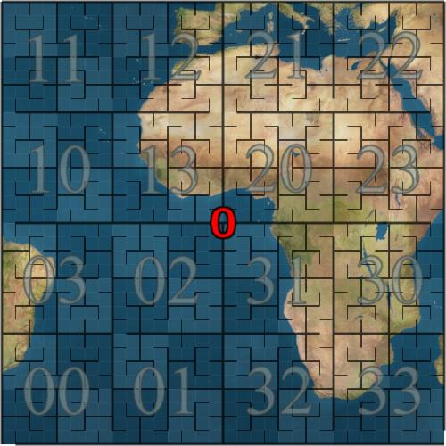
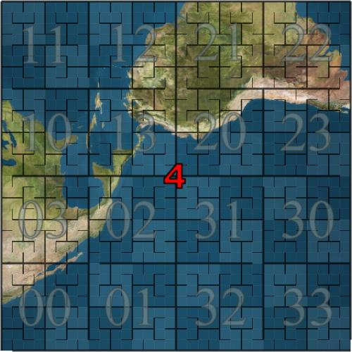

The S2Cell hierarchy projects the Earth onto six top-level "face cells",
which may be unwrapped and flattened into a stairstep arrangement. Below
is a map of the six faces:

A single space-filling curve covers the entire globe, snaking from one
face to the next. Note the traversal order in the odd-numbered faces is
the mirror of the order in even numbered faces.

~~~~
                  ^---->  <----^
                  | 4  |    5  |
                  |    |       |
                  x    V  ----->

          ^---->  <----^
          | 2  |    3  |
          |    |       |
          x    V  ----->

  ^---->  <----^
  | 0  |    1  |
  |    |       |
  x    v  ----->
~~~~

You can print out the following six images on a good color printer, glue
them onto sturdy cardboard squares and tape them together to form a
cube, to make a model S2Cell-Hierarchy Globe, which will let you
visually locate any cell at level 5 or higher.

CAVEAT: While these images are conceptually useful, the satellite imagery has
not been transformed correctly, so don't rely on these images to determine
which geographic features are contained by a given `S2CellId`.

